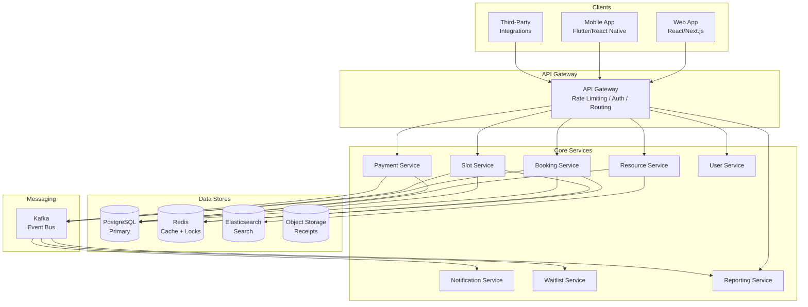

# Slot Booking System

> **Production-Grade, Multi-Domain Time-Slot Reservation Platform**

A fully-documented, implementation-ready design for a generalized slot and time-block booking engine supporting sports courts, meeting rooms, medical appointments, salon services, studio time, parking, and any other resource that operates on scheduled availability windows.

---

## Key Features

| Feature | Description |
|---------|-------------|
| **Resource & Venue Management** | Define courts, rooms, studios, seats, or any bookable asset with capacity, pricing tiers, and operating hours |
| **Flexible Slot Configuration** | Slot durations are multiples of `ResourceType.min_duration_minutes`; supports 15-min increments through multi-day blocks |
| **Real-Time Availability Calendar** | Atomic slot reservation with optimistic locking; live availability pushed via WebSocket or SSE |
| **Online Booking with Payment** | Coupled payment flow (confirm-on-capture) and decoupled flow (hold-then-pay) with automatic expiry |
| **Recurring Bookings** | Daily, weekly, and custom-cadence series with conflict detection and series-level management |
| **Waitlist Management** | Automatic promotion of first-eligible waitlist entry on cancellation; 30-minute confirmation window |
| **Cancellation & Refund Policies** | Configurable lead-time tiers; same-day cancellations incur penalty rate; no-shows receive zero refund |
| **Staff Scheduling & Assignment** | Assign staff to resources or specific slots; support double-booking guards per staff member |
| **Bulk / Corporate Booking** | Monthly quota enforcement for corporate accounts; excess bookings routed for corporate admin approval |
| **SMS / Email Notifications** | Confirmation, reminder (24h and 1h before), cancellation, waitlist-promotion, and no-show alerts |
| **Admin Override & Manual Booking** | Privileged API paths for front-desk and ops teams with audit trail |
| **Reporting & Occupancy Analytics** | Utilization rate, revenue, no-show rate, cancellation rate by resource, venue, and time period |

---

## Domain Adaptability

| Domain | Resource | Slot Window | Capacity Model |
|--------|----------|------------|----------------|
| **Sports** | Tennis / Futsal Court | 30 min – 2 h | Exclusive (1 team) |
| **Healthcare** | Doctor / Examination Room | 15 – 60 min | Exclusive (1 patient) |
| **Coworking** | Meeting Room / Hot Desk | 30 min – 8 h | Exclusive or shared |
| **Beauty & Wellness** | Salon Chair / Spa Room | 30 – 90 min | Exclusive (1 client) |
| **Creative Studios** | Recording / Photo Studio | 1 – 8 h | Exclusive |
| **Education** | Classroom / Tutor | 45 – 90 min | Group (up to capacity) |
| **Parking** | Parking Bay | 30 min – 30 days | Exclusive |
| **Events** | Hall / Auditorium | Half-day / Full-day | Group (ticketed capacity) |

---

## Documentation Structure

Project root artifact: [`traceability-matrix.md`](./traceability-matrix.md) provides cross-phase requirement-to-implementation linkage.

| Path | Description |
|------|-------------|
| `requirements/requirements-document.md` | 40+ functional and non-functional requirements with MoSCoW priority |
| `requirements/user-stories.md` | 25+ user stories across 6 epics with acceptance criteria |
| `analysis/use-case-diagram.md` | Actor–use-case Mermaid diagram for all roles |
| `analysis/use-case-descriptions.md` | Detailed pre/post conditions and main/alternate flows |
| `analysis/system-context-diagram.md` | External actors and system boundary |
| `analysis/activity-diagram.md` | Booking, cancellation, and waitlist activity flowcharts |
| `analysis/bpmn-swimlane-diagram.md` | End-to-end booking and payment BPMN swimlane |
| `analysis/data-dictionary.md` | Canonical entity definitions, attribute types, ER diagram |
| `analysis/business-rules.md` | BR-01 through BR-09 enforceable rules with evaluation pipeline |
| `analysis/event-catalog.md` | 12+ domain events with payload contracts and SLOs |
| `high-level-design/system-sequence-diagram.md` | System-level sequence for core booking flow |
| `high-level-design/domain-model.md` | Aggregate boundaries and domain objects |
| `high-level-design/data-flow-diagram.md` | Level-0 and Level-1 DFDs |
| `high-level-design/architecture-diagram.md` | Microservice architecture overview |
| `high-level-design/c4-context-container.md` | C4 context and container diagrams |
| `detailed-design/class-diagram.md` | Full class hierarchy with relationships |
| `detailed-design/sequence-diagram.md` | Detailed inter-service sequences |
| `detailed-design/state-machine-diagram.md` | Booking and slot state machines |
| `detailed-design/erd-database-schema.md` | Full PostgreSQL schema with indexes and constraints |
| `detailed-design/component-diagram.md` | Internal component breakdown per service |
| `detailed-design/api-design.md` | REST API specification for all endpoints |
| `detailed-design/c4-component.md` | C4 component diagram for Booking Service |
| `infrastructure/deployment-diagram.md` | Kubernetes deployment topology |
| `infrastructure/network-infrastructure.md` | VPC, subnets, security groups, and firewall rules |
| `infrastructure/cloud-architecture.md` | AWS multi-AZ cloud architecture |
| `infrastructure/booking-runtime-patterns.md` | Cache/lock/messaging/hotspot strategies for booking runtime |
| `implementation/code-guidelines.md` | Language conventions, patterns, and quality gates |
| `implementation/c4-code-diagram.md` | C4 code-level diagram for Booking aggregate |
| `implementation/implementation-playbook.md` | Sprint-by-sprint delivery plan with acceptance criteria |
| `edge-cases/README.md` | Edge-case taxonomy and severity classification |
| `edge-cases/slot-availability.md` | Race conditions, timezone handling, DST edge cases |
| `edge-cases/booking-and-payments.md` | Payment failure, partial capture, idempotency |
| `edge-cases/cancellations-and-refunds.md` | Policy ambiguity, partial refunds, gateway failures |
| `edge-cases/notifications.md` | Delivery failures, duplicate suppression, preference conflicts |
| `edge-cases/api-and-ui.md` | Malformed requests, pagination, stale UI state |
| `edge-cases/security-and-compliance.md` | Auth bypass, PII handling, audit trail integrity |
| `edge-cases/operations.md` | Database failover, job retry storms, data reconciliation |

---

## Getting Started

- Review [`traceability-matrix.md`](./traceability-matrix.md) first to navigate requirement-to-implementation coverage across phases.
### For Architects
1. Read the system context: `analysis/system-context-diagram.md`
2. Review the domain model: `high-level-design/domain-model.md`
3. Understand bounded contexts: `high-level-design/c4-context-container.md`

### For Backend Engineers
1. Study the API contract: `detailed-design/api-design.md`
2. Implement the database schema: `detailed-design/erd-database-schema.md`
3. Follow business rules strictly: `analysis/business-rules.md`
4. Subscribe to domain events: `analysis/event-catalog.md`

### For Product Managers
1. Start with requirements: `requirements/requirements-document.md`
2. Review user stories: `requirements/user-stories.md`
3. Track delivery: `implementation/implementation-playbook.md`

### For QA Engineers
1. Review edge cases: `edge-cases/README.md`
2. Test booking flows: `edge-cases/booking-and-payments.md`
3. Validate business rules: `analysis/business-rules.md`

---

## Architecture Overview

---

## Performance Targets

| Metric | Target | Notes |
|--------|--------|-------|
| API Response p95 | < 200 ms | Availability check and booking create |
| API Response p99 | < 500 ms | Complex recurring booking creation |
| Concurrent Users | 10,000+ | Across all tenants |
| Booking Throughput | 1,000 / min | Peak event windows |
| Availability Query | < 50 ms | Redis-cached slot grid |
| Event Publish Latency | < 5 s p95 | Outbox relay to Kafka |
| System Uptime | 99.9% | 8.7 h downtime / year |
| RTO | 30 min | Regional failover |
| RPO | 5 min | WAL streaming replication |

---

## Documentation Status

- ✅ Traceability coverage is available via [`traceability-matrix.md`](./traceability-matrix.md).
| File | Status | Diagrams | Lines |
|------|--------|----------|-------|
| `README.md` | ✅ Complete | 1 | ~200 |
| `requirements/requirements-document.md` | ✅ Complete | 1 | ~300 |
| `requirements/user-stories.md` | ✅ Complete | — | ~280 |
| `analysis/use-case-diagram.md` | ✅ Complete | 1 | ~180 |
| `analysis/use-case-descriptions.md` | ✅ Complete | — | ~350 |
| `analysis/system-context-diagram.md` | ✅ Complete | 1 | ~160 |
| `analysis/activity-diagram.md` | ✅ Complete | 3 | ~250 |
| `analysis/bpmn-swimlane-diagram.md` | ✅ Complete | 2 | ~200 |
| `analysis/data-dictionary.md` | ✅ Complete | 1 | ~350 |
| `analysis/business-rules.md` | ✅ Complete | 1 | ~300 |
| `analysis/event-catalog.md` | ✅ Complete | 1 | ~280 |
| `high-level-design/system-sequence-diagram.md` | ✅ Complete | 1 | ~200 |
| `high-level-design/domain-model.md` | ✅ Complete | 1 | ~220 |
| `high-level-design/data-flow-diagram.md` | ✅ Complete | 2 | ~200 |
| `high-level-design/architecture-diagram.md` | ✅ Complete | 1 | ~250 |
| `high-level-design/c4-context-container.md` | ✅ Complete | 2 | ~220 |
| `detailed-design/class-diagram.md` | ✅ Complete | 1 | ~300 |
| `detailed-design/sequence-diagram.md` | ✅ Complete | 2 | ~280 |
| `detailed-design/state-machine-diagram.md` | ✅ Complete | 2 | ~220 |
| `detailed-design/erd-database-schema.md` | ✅ Complete | 1 | ~400 |
| `detailed-design/component-diagram.md` | ✅ Complete | 1 | ~220 |
| `detailed-design/api-design.md` | ✅ Complete | 1 | ~500 |
| `detailed-design/c4-component.md` | ✅ Complete | 1 | ~200 |
| `infrastructure/deployment-diagram.md` | ✅ Complete | 1 | ~220 |
| `infrastructure/network-infrastructure.md` | ✅ Complete | 1 | ~200 |
| `infrastructure/cloud-architecture.md` | ✅ Complete | 1 | ~220 |
| `implementation/code-guidelines.md` | ✅ Complete | — | ~280 |
| `implementation/c4-code-diagram.md` | ✅ Complete | 1 | ~200 |
| `implementation/implementation-playbook.md` | ✅ Complete | 1 | ~350 |
| `edge-cases/README.md` | ✅ Complete | 1 | ~180 |
| `edge-cases/slot-availability.md` | ✅ Complete | 1 | ~220 |
| `edge-cases/booking-and-payments.md` | ✅ Complete | 1 | ~250 |
| `edge-cases/cancellations-and-refunds.md` | ✅ Complete | 1 | ~220 |
| `edge-cases/notifications.md` | ✅ Complete | — | ~180 |
| `edge-cases/api-and-ui.md` | ✅ Complete | — | ~180 |
| `edge-cases/security-and-compliance.md` | ✅ Complete | — | ~200 |
| `edge-cases/operations.md` | ✅ Complete | 1 | ~200 |

**37 files · 7 sections · 30+ Mermaid diagrams · ~8,500 lines**

---

## Technology Stack Reference

| Layer | Recommended | Alternatives |
|-------|-------------|-------------|
| Frontend | React + Next.js | Vue 3, Flutter Web |
| Mobile | React Native | Flutter |
| API Gateway | Kong / AWS API Gateway | Nginx, Envoy |
| Backend Services | Node.js (TypeScript) | Go, Java Spring Boot, Python FastAPI |
| Primary Database | PostgreSQL 15+ | MySQL 8 |
| Cache & Locks | Redis 7 | Valkey |
| Search | Elasticsearch 8 | OpenSearch |
| Message Broker | Apache Kafka | RabbitMQ |
| Object Storage | AWS S3 | GCS, Azure Blob |
| Container Orchestration | Kubernetes (EKS) | GKE, AKS |
| CI/CD | GitHub Actions | GitLab CI, Argo CD |
| Observability | Prometheus + Grafana + Jaeger | Datadog, New Relic |
| Payment Gateway | Stripe | Razorpay, Adyen, PayPal |
| SMS / Email | Twilio + SendGrid | AWS SNS + SES |

All Mermaid diagrams render natively on GitHub and in VS Code with the Mermaid extension.
