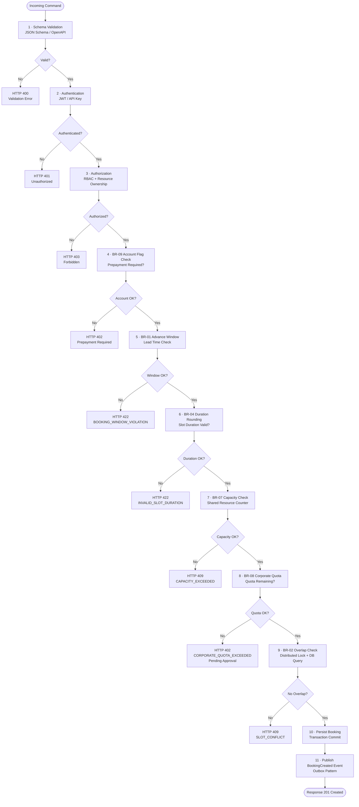

# Business Rules — Slot Booking System

This document is the authoritative source of enforceable policy rules for the Slot Booking System. Every rule is assigned a stable identifier, enforcement point, error code, and override policy. All command-processing services, background jobs, and administrative consoles must evaluate rules in the order defined in the Rule Evaluation Pipeline.

---

## Scope

| Dimension | Detail |
|-----------|--------|
| **Domain** | Time-slot reservation across sports, healthcare, coworking, beauty, studio, parking, and event venues |
| **Rule Categories** | Temporal constraints, conflict prevention, financial policy, waitlist lifecycle, recurring series, capacity, access control |
| **Enforcement Points** | REST API layer, Booking Service domain logic, background job processors, admin console |
| **Rule Version** | v2.1.0 — effective from 2024-01-01 |

---

## Enforceable Rules

### BR-01 — Advance Booking Window

| Attribute | Value |
|-----------|-------|
| **ID** | BR-01 |
| **Name** | Advance Booking Window |
| **Category** | Temporal Constraint |
| **Enforcement** | Booking Service — `createBooking` handler |
| **Error Code** | `BOOKING_WINDOW_VIOLATION` |
| **HTTP Status** | 422 Unprocessable Entity |

**Rule:** A booking request is valid only if:

```
slot.start_time - NOW() >= ResourceType.min_advance_hours   (default: 1 hour)
slot.start_time - NOW() <= ResourceType.max_advance_days    (default: 90 days)
```

Both thresholds are configurable per `ResourceType` and overridable per `Venue` via `ServiceConfig`. Requests outside the window are rejected synchronously with the booking window violation error. Admin actors with the `OVERRIDE_BOOKING_WINDOW` permission may bypass this rule; the override must include a rationale and is logged in the audit trail.

**Implementation Notes:**
- Always compute lead time against UTC; convert to venue local time for display only.
- `min_advance_hours = 0` is allowed only for walk-in resources (e.g., parking) configured with `allow_instant_booking = true`.

---

### BR-02 — Overlap Prevention

| Attribute | Value |
|-----------|-------|
| **ID** | BR-02 |
| **Name** | Overlap Prevention |
| **Category** | Conflict Prevention |
| **Enforcement** | Database layer + Booking Service pessimistic lock |
| **Error Code** | `SLOT_CONFLICT` |
| **HTTP Status** | 409 Conflict |

**Rule:** No two `Booking` records in `CONFIRMED` or `PENDING_PAYMENT` state may overlap for the same `resource_id`:

```sql
SELECT COUNT(*) FROM bookings
WHERE resource_id = :rid
  AND status IN ('CONFIRMED', 'PENDING_PAYMENT')
  AND tstzrange(start_time, end_time) && tstzrange(:new_start, :new_end)
  AND id != :exclude_id;
-- Result must be 0
```

Concurrent requests are handled with a Redis distributed lock keyed on `resource_id` with a 5-second TTL. If the lock cannot be acquired within 3 seconds the request returns HTTP 503 with a `Retry-After: 5` header. Shared-capacity resources (see BR-07) bypass the exclusivity check but decrement an atomic capacity counter instead.

---

### BR-03 — Cancellation Policy and Penalty

| Attribute | Value |
|-----------|-------|
| **ID** | BR-03 |
| **Name** | Cancellation Policy |
| **Category** | Financial Policy |
| **Enforcement** | Booking Service — `cancelBooking` handler + Refund Service |
| **Error Code** | `CANCELLATION_POLICY_APPLIED` |
| **HTTP Status** | 200 OK (penalty amount returned in response body) |

**Rule:** The refund amount depends on the lead time at the moment of cancellation:

| Cancellation Lead Time | Refund Percentage | Penalty |
|------------------------|-------------------|---------|
| > `policy.free_cancel_hours` (default 24 h) | 100% | None |
| ≤ 24 h and > 0 h before slot start | 50% | 50% of `booking.total_amount` |
| After slot start (no-show) | 0% | 100% of `booking.total_amount` |

- `policy.free_cancel_hours`, `policy.penalty_rate`, and `policy.no_refund_window_hours` are stored in `ServiceConfig` per `ResourceType`.
- Cancellation fee is charged by retaining the corresponding portion of the original payment; it is never an additional charge.
- Corporate accounts may have negotiated penalty rates stored in `CorporateAccount.penalty_override_rate`.

---

### BR-04 — Slot Duration Rounding

| Attribute | Value |
|-----------|-------|
| **ID** | BR-04 |
| **Name** | Slot Duration Rounding |
| **Category** | Data Integrity |
| **Enforcement** | Slot Service — `createSlot` / `generateSlots` |
| **Error Code** | `INVALID_SLOT_DURATION` |
| **HTTP Status** | 422 Unprocessable Entity |

**Rule:** The duration of any `Slot` must satisfy:

```
(slot.end_time - slot.start_time) mod ResourceType.min_duration_minutes == 0
```

Typical values for `min_duration_minutes`: 15, 30, 60. The field defaults to 30 minutes when not explicitly configured. Slot generation jobs round up to the next valid boundary if the schedule template produces a fractional duration. Manual slot creation requests that violate this rule are rejected immediately.

---

### BR-05 — Waitlist Auto-Promotion

| Attribute | Value |
|-----------|-------|
| **ID** | BR-05 |
| **Name** | Waitlist Auto-Promotion |
| **Category** | Waitlist Lifecycle |
| **Enforcement** | Waitlist Service — triggered by `BookingCancelled` event |
| **Error Code** | N/A (async process) |
| **Timeout** | Customer has 30 minutes to accept promotion |

**Rule:** When a `Booking` transitions to `CANCELLED`, the Waitlist Service:

1. Queries `WaitlistEntry` records for the same `slot_id`, ordered by `priority ASC, joined_at ASC`.
2. Selects the first entry where the customer's account is not flagged and the slot still fits the customer's requested duration.
3. Sends a `WaitlistPromoted` event and a real-time notification (push + email).
4. Creates a provisional `Booking` in `WAITLIST_PROMOTED` state with a 30-minute expiry.
5. If the customer confirms and pays within 30 minutes, booking moves to `CONFIRMED`.
6. If the customer does not respond, the booking expires and the next waitlist entry is evaluated.

The process repeats until the slot is filled or the waitlist is exhausted. Failed promotion attempts are recorded with reason codes in `WaitlistEntry.promotion_history`.

---

### BR-06 — Recurring Booking Conflict Resolution

| Attribute | Value |
|-----------|-------|
| **ID** | BR-06 |
| **Name** | Recurring Booking Conflict |
| **Category** | Recurring Series Integrity |
| **Enforcement** | Booking Service — `createRecurringSeries` + nightly conflict scan job |
| **Error Code** | `RECURRING_CONFLICT_DETECTED` |
| **HTTP Status** | 409 Conflict (at creation); async for in-flight series |

**Rule:** When generating a recurring booking series:

- Each individual occurrence is validated against BR-02 before the series is committed.
- If any occurrence in the series conflicts, the **entire series is rejected** at creation time with a list of conflicting dates.
- For an existing series where a future occurrence is blocked by a subsequently-created booking:
  - The conflicting occurrence is moved to `SERIES_PAUSED` state.
  - The customer and venue admin are notified within 15 minutes.
  - Resolution (rescheduling or manual cancellation) must occur within **48 hours**.
  - After 48 hours without resolution the entire series transitions to `CANCELLED`.
- A series may be partially paused: non-conflicting occurrences continue to run normally.

---

### BR-07 — Capacity-Based Overbooking

| Attribute | Value |
|-----------|-------|
| **ID** | BR-07 |
| **Name** | Capacity Overbooking |
| **Category** | Capacity Management |
| **Enforcement** | Booking Service — capacity counter on shared resources |
| **Error Code** | `CAPACITY_EXCEEDED` |
| **HTTP Status** | 409 Conflict |

**Rule:** For group resources (e.g., fitness classes, shuttle buses, shared coworking spaces):

```
effective_capacity = Resource.capacity * ResourceType.overbooking_factor
```

- `overbooking_factor` defaults to `1.0` (no overbooking). Values above `1.0` allow overbooking; e.g., `1.2` allows 20% excess.
- The atomic booking counter is maintained in Redis and reconciled with PostgreSQL every 60 seconds.
- When `confirmed_count >= effective_capacity`, the slot transitions to `WAITLIST_ONLY` state; new requests are redirected to the waitlist.
- Overbooking is only available for `ResourceType.resource_class = SHARED`; exclusive resources always use `overbooking_factor = 1.0`.

---

### BR-08 — Corporate Quota Management

| Attribute | Value |
|-----------|-------|
| **ID** | BR-08 |
| **Name** | Corporate Quota |
| **Category** | Access Control |
| **Enforcement** | Booking Service — quota check for corporate-linked customers |
| **Error Code** | `CORPORATE_QUOTA_EXCEEDED` |
| **HTTP Status** | 402 Payment Required (pending approval) |

**Rule:** Corporate accounts are allocated a monthly `slot_quota` stored in `CorporateAccount.monthly_quota`:

1. Each booking by a corporate-linked customer decrements `CorporateAccount.quota_used` atomically.
2. If `quota_used >= monthly_quota`, the booking is placed in `PENDING_CORPORATE_APPROVAL` state instead of proceeding to payment.
3. The corporate admin is notified and must approve or reject within 24 hours.
4. Approved bookings proceed to the normal payment flow.
5. Rejected bookings are cancelled and the customer notified.
6. Quota resets to 0 on `CorporateAccount.billing_cycle_day` each month. Unused quota does **not** roll over.

Corporate admins may adjust the quota mid-cycle; changes take effect immediately and are logged with the approver's identity.

---

### BR-09 — No-Show Penalty

| Attribute | Value |
|-----------|-------|
| **ID** | BR-09 |
| **Name** | No-Show Penalty |
| **Category** | Customer Account Management |
| **Enforcement** | Booking Service — post-slot-end check job + Customer Service flag |
| **Error Code** | `ACCOUNT_PREPAYMENT_REQUIRED` |
| **HTTP Status** | 402 Payment Required |

**Rule:** A `Booking` is marked `NO_SHOW` by a background job running 15 minutes after `slot.end_time` if the booking has not been manually checked in and is still in `CONFIRMED` state.

- If a customer accumulates **3 or more no-shows within a rolling 90-day window**, their account is flagged: `Customer.prepayment_required = true`.
- While flagged, all future bookings require full payment capture at booking time (no pay-at-venue or invoice options).
- The flag is automatically cleared if the customer completes **5 consecutive attended bookings** after the flag is set.
- Venue admins may manually clear the flag with a documented reason; the action is recorded in the audit trail.
- No-show counts exclude occurrences where the venue cancelled the slot or a force-majeure override was applied.

---

## Rule Evaluation Pipeline

All state-changing commands pass through this pipeline in order. A rule rejection at any stage short-circuits the pipeline and returns the corresponding error.



---

## Rule Interaction Matrix

| Rule | Triggers | Interacts With | Can Be Overridden By |
|------|----------|---------------|----------------------|
| BR-01 | createBooking | BR-02 | Admin with `OVERRIDE_BOOKING_WINDOW` |
| BR-02 | createBooking, confirmBooking | BR-07 | Admin with `FORCE_BOOKING` |
| BR-03 | cancelBooking | BR-09 (no-show) | Admin with `WAIVE_PENALTY` |
| BR-04 | createSlot, generateSlots | BR-06 | System only (slot generation job) |
| BR-05 | BookingCancelled event | BR-07, BR-09 | None (fully automated) |
| BR-06 | createRecurringSeries | BR-02, BR-04 | Admin with `RESOLVE_SERIES_CONFLICT` |
| BR-07 | createBooking for SHARED resources | BR-02 | Admin with `OVERRIDE_CAPACITY` |
| BR-08 | createBooking for corporate customers | — | Corporate Admin or Platform Admin |
| BR-09 | Post-slot check job, cancelBooking | BR-03 | Venue Admin with documented reason |

---

## Exception and Override Handling

### Override Permission Matrix

| Override Permission | Granted To | Audit Required | Expiry |
|--------------------|------------|----------------|--------|
| `OVERRIDE_BOOKING_WINDOW` | Platform Admin, Venue Admin | Yes | Single use |
| `FORCE_BOOKING` | Platform Admin | Yes | Single use |
| `WAIVE_PENALTY` | Venue Admin, Platform Admin | Yes | Single use |
| `OVERRIDE_CAPACITY` | Platform Admin | Yes | Single use |
| `RESOLVE_SERIES_CONFLICT` | Venue Admin, Platform Admin | Yes | 48 h |
| `CLEAR_NOSH0W_FLAG` | Venue Admin | Yes | Permanent |

### Override Request Flow

Every override is submitted via `POST /admin/overrides` with:

```json
{
  "booking_id": "bk_abc123",
  "rule_id": "BR-01",
  "reason": "VIP customer — venue manager approved extension",
  "approver_id": "usr_admin_xyz",
  "override_permission": "OVERRIDE_BOOKING_WINDOW"
}
```

The override record is stored in `AuditEvent` with `event_type = RULE_OVERRIDE` and linked to the booking. Override records are retained for 7 years for compliance purposes.

### Repeated Override Patterns

If the same rule is overridden more than 5 times in a rolling 30-day window for the same venue, an alert is raised for policy review. The system automatically flags the pattern in the compliance dashboard under `ComplianceAlert.category = RULE_OVERRIDE_SPIKE`.

### Force-Majeure Handling

Venue admins may declare a `force_majeure_event` via the admin console. This:

1. Cancels all affected bookings with `cancellation_reason = FORCE_MAJEURE`.
2. Issues full refunds regardless of BR-03.
3. Clears no-show records for affected slots from the BR-09 rolling window.
4. Sends mass notification to affected customers with the force-majeure reason.

Force-majeure declarations require a written justification stored in `BlockRule.block_reason`.

---

## Configuration Reference

All configurable rule thresholds are stored in the `service_configs` table, scoped to `(resource_type_id, venue_id)`. Venue-level overrides take precedence over resource-type defaults.

| Config Key | Default Value | Rule | Unit |
|------------|--------------|------|------|
| `min_advance_hours` | 1 | BR-01 | hours |
| `max_advance_days` | 90 | BR-01 | days |
| `free_cancel_hours` | 24 | BR-03 | hours |
| `penalty_rate` | 0.50 | BR-03 | decimal (0–1) |
| `min_duration_minutes` | 30 | BR-04 | minutes |
| `waitlist_confirm_minutes` | 30 | BR-05 | minutes |
| `series_conflict_resolve_hours` | 48 | BR-06 | hours |
| `overbooking_factor` | 1.0 | BR-07 | decimal (≥ 1.0) |
| `no_show_threshold` | 3 | BR-09 | count |
| `no_show_window_days` | 90 | BR-09 | days |
| `prepayment_clear_bookings` | 5 | BR-09 | count |
