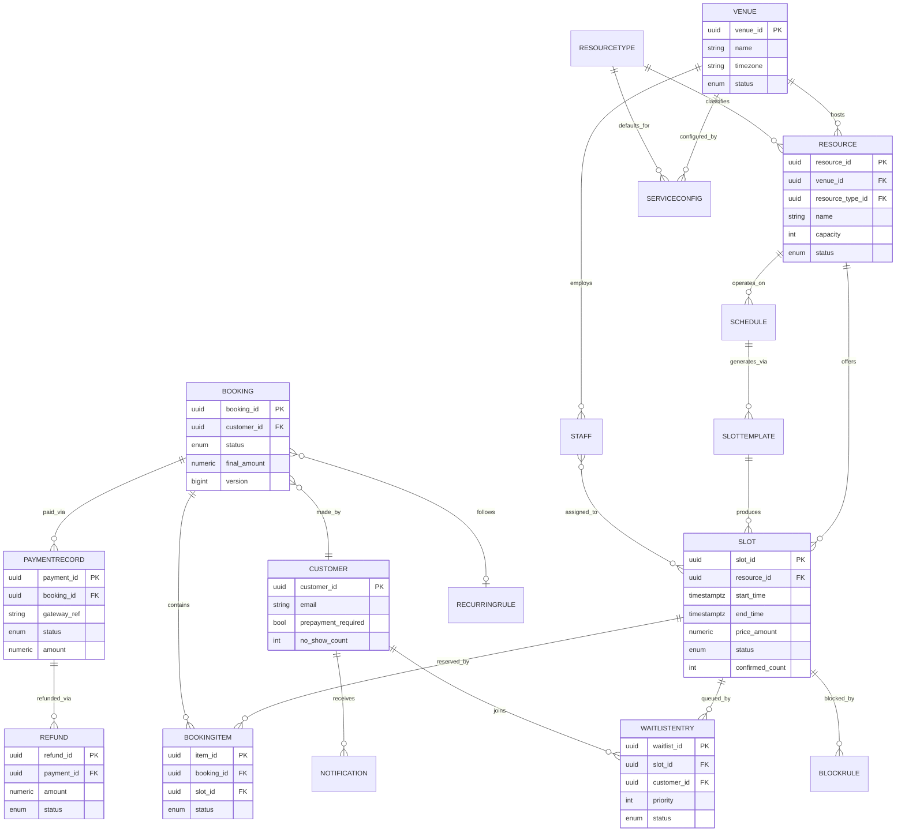

# Data Dictionary — Slot Booking System

This is the canonical reference for all entities, attributes, relationships, and data quality controls in the Slot Booking System. All services, APIs, and analytics pipelines must use the definitions in this document as the authoritative vocabulary.

---

## Scope and Goals

| Objective | Detail |
|-----------|--------|
| **Shared Vocabulary** | Unified terminology across backend services, mobile apps, analytics, and documentation |
| **Entity Boundaries** | Clear ownership, aggregate roots, and relationship types |
| **Attribute Contracts** | Data types, constraints, defaults, and nullability for all persistent fields |
| **Data Quality** | Validation rules, duplicate detection, and retention policies |
| **Dictionary Version** | v3.0.0 — last updated 2024-01-01 |

---

## Core Entities

| Entity | Aggregate Root? | Description | Primary Key | Owner Service |
|--------|----------------|-------------|-------------|---------------|
| **ResourceType** | Yes | Template defining a class of bookable assets (e.g., Tennis Court, Consultation Room). Holds default duration, pricing, and rule thresholds. | `resource_type_id` UUID | Resource Service |
| **Venue** | Yes | Physical or virtual location that owns one or more resources (e.g., Greenfield Sports Club, City Medical Centre). Contains operating hours and timezone. | `venue_id` UUID | Resource Service |
| **Resource** | Yes | A specific bookable unit within a venue (e.g., Court A, Room 3B, Bay 12). Belongs to exactly one `ResourceType`. | `resource_id` UUID | Resource Service |
| **Schedule** | No | Operating calendar for a resource defining which days and time windows slots may be generated. Supports weekly templates and date-range overrides. | `schedule_id` UUID | Slot Service |
| **SlotTemplate** | No | Pattern used to generate individual slots (duration, buffer, pricing tier). One template can produce many slots. | `template_id` UUID | Slot Service |
| **Slot** | Yes | A specific time window on a specific resource that may be booked (e.g., Court A · 2024-03-15 · 10:00–11:00). | `slot_id` UUID | Slot Service |
| **Booking** | Yes | A customer's reservation of one or more slots. The primary financial and lifecycle object. | `booking_id` UUID | Booking Service |
| **BookingItem** | No | Individual slot line within a multi-slot booking. Links `Booking` to `Slot` with its own status. | `item_id` UUID | Booking Service |
| **Customer** | Yes | End-user account that creates and manages bookings. May belong to a `CorporateAccount`. | `customer_id` UUID | User Service |
| **Staff** | No | Venue employee assignable to resources or slots (instructor, therapist, front-desk agent). | `staff_id` UUID | User Service |
| **PaymentRecord** | Yes | Financial transaction record tied to a `Booking`. Tracks gateway reference, amount, currency, and lifecycle state. | `payment_id` UUID | Payment Service |
| **Refund** | No | Partial or full reversal of a `PaymentRecord`. Records refund amount, reason, and gateway reference. | `refund_id` UUID | Payment Service |
| **WaitlistEntry** | No | A customer's position in a waitlist queue for a fully-booked `Slot`. Promoted automatically on cancellation (BR-05). | `waitlist_id` UUID | Waitlist Service |
| **BlockRule** | No | A time-range exclusion applied to a `Resource` or `Venue` to prevent bookings (e.g., maintenance, holiday closure). | `block_id` UUID | Slot Service |
| **RecurringRule** | No | Defines the cadence and end condition for a series of recurring bookings (DAILY / WEEKLY / MONTHLY / CUSTOM). | `rule_id` UUID | Booking Service |
| **Notification** | No | Record of an outbound message (email, SMS, push) sent to a `Customer` or `Staff` member regarding a booking event. | `notification_id` UUID | Notification Service |
| **ServiceConfig** | No | Key-value configuration store scoped to `(resource_type_id, venue_id)`. Used to override default rule thresholds (BR-01 through BR-09). | `config_id` UUID | Config Service |

---

## Attribute Detail

### ResourceType

| Attribute | Type | Nullable | Default | Description |
|-----------|------|----------|---------|-------------|
| `resource_type_id` | UUID | No | gen_random_uuid() | Primary key |
| `name` | VARCHAR(120) | No | — | Human-readable type name (e.g., "Tennis Court") |
| `resource_class` | ENUM | No | EXCLUSIVE | `EXCLUSIVE` or `SHARED`; determines overlap and overbooking behaviour |
| `min_duration_minutes` | SMALLINT | No | 30 | Minimum slot duration and rounding base (BR-04) |
| `max_duration_minutes` | SMALLINT | No | 480 | Maximum single slot duration |
| `overbooking_factor` | NUMERIC(4,2) | No | 1.00 | Allowed overbook ratio; 1.0 = no overbooking (BR-07) |
| `min_advance_hours` | SMALLINT | No | 1 | Earliest booking creation lead time (BR-01) |
| `max_advance_days` | SMALLINT | No | 90 | Latest booking creation lead time (BR-01) |
| `created_at` | TIMESTAMPTZ | No | NOW() | Record creation timestamp |
| `updated_at` | TIMESTAMPTZ | No | NOW() | Last modification timestamp |

### Venue

| Attribute | Type | Nullable | Default | Description |
|-----------|------|----------|---------|-------------|
| `venue_id` | UUID | No | gen_random_uuid() | Primary key |
| `name` | VARCHAR(200) | No | — | Venue display name |
| `address_line1` | VARCHAR(255) | No | — | Street address |
| `city` | VARCHAR(100) | No | — | City |
| `country_code` | CHAR(2) | No | — | ISO 3166-1 alpha-2 |
| `timezone` | VARCHAR(60) | No | — | IANA timezone identifier (e.g., `Asia/Kolkata`) |
| `status` | ENUM | No | ACTIVE | `ACTIVE`, `SUSPENDED`, `CLOSED` |
| `created_at` | TIMESTAMPTZ | No | NOW() | Record creation timestamp |

### Resource

| Attribute | Type | Nullable | Default | Description |
|-----------|------|----------|---------|-------------|
| `resource_id` | UUID | No | gen_random_uuid() | Primary key |
| `venue_id` | UUID | No | — | FK → Venue |
| `resource_type_id` | UUID | No | — | FK → ResourceType |
| `name` | VARCHAR(120) | No | — | Resource display name (e.g., "Court A") |
| `capacity` | SMALLINT | No | 1 | Maximum simultaneous occupants |
| `status` | ENUM | No | ACTIVE | `ACTIVE`, `MAINTENANCE`, `DECOMMISSIONED` |
| `amenities` | JSONB | Yes | {} | Free-form amenity tags (e.g., `{"aircon": true, "projector": true}`) |
| `created_at` | TIMESTAMPTZ | No | NOW() | Record creation timestamp |

### Slot

| Attribute | Type | Nullable | Default | Description |
|-----------|------|----------|---------|-------------|
| `slot_id` | UUID | No | gen_random_uuid() | Primary key |
| `resource_id` | UUID | No | — | FK → Resource |
| `template_id` | UUID | Yes | — | FK → SlotTemplate (null for manually created slots) |
| `start_time` | TIMESTAMPTZ | No | — | Slot start (stored in UTC) |
| `end_time` | TIMESTAMPTZ | No | — | Slot end (stored in UTC); must satisfy BR-04 |
| `price_amount` | NUMERIC(12,2) | No | — | Slot price in `price_currency` |
| `price_currency` | CHAR(3) | No | — | ISO 4217 currency code |
| `status` | ENUM | No | AVAILABLE | `AVAILABLE`, `BOOKED`, `WAITLIST_ONLY`, `BLOCKED`, `CANCELLED` |
| `confirmed_count` | SMALLINT | No | 0 | Current confirmed bookings (for shared resources) |
| `created_at` | TIMESTAMPTZ | No | NOW() | Record creation timestamp |

### Booking

| Attribute | Type | Nullable | Default | Description |
|-----------|------|----------|---------|-------------|
| `booking_id` | UUID | No | gen_random_uuid() | Primary key |
| `customer_id` | UUID | No | — | FK → Customer |
| `corporate_account_id` | UUID | Yes | NULL | FK → CorporateAccount (if corporate booking) |
| `recurring_rule_id` | UUID | Yes | NULL | FK → RecurringRule (if part of a series) |
| `status` | ENUM | No | PENDING_PAYMENT | See state machine in `detailed-design/state-machine-diagram.md` |
| `total_amount` | NUMERIC(12,2) | No | — | Sum of all BookingItems before discounts |
| `discount_amount` | NUMERIC(12,2) | No | 0.00 | Applied discount (promo codes, corporate rate) |
| `final_amount` | NUMERIC(12,2) | No | — | `total_amount - discount_amount` |
| `currency` | CHAR(3) | No | — | ISO 4217 |
| `cancellation_reason` | VARCHAR(500) | Yes | NULL | Populated on cancellation |
| `no_show_at` | TIMESTAMPTZ | Yes | NULL | Timestamp when no-show was recorded |
| `version` | BIGINT | No | 1 | Optimistic lock version counter |
| `created_at` | TIMESTAMPTZ | No | NOW() | Record creation timestamp |
| `updated_at` | TIMESTAMPTZ | No | NOW() | Last modification timestamp |

### WaitlistEntry

| Attribute | Type | Nullable | Default | Description |
|-----------|------|----------|---------|-------------|
| `waitlist_id` | UUID | No | gen_random_uuid() | Primary key |
| `slot_id` | UUID | No | — | FK → Slot |
| `customer_id` | UUID | No | — | FK → Customer |
| `priority` | SMALLINT | No | 100 | Lower number = higher priority; corporate = 10, VIP = 1 |
| `joined_at` | TIMESTAMPTZ | No | NOW() | When customer joined the waitlist |
| `expires_at` | TIMESTAMPTZ | Yes | NULL | Populated when customer is promoted; 30-minute window (BR-05) |
| `status` | ENUM | No | WAITING | `WAITING`, `PROMOTED`, `CONFIRMED`, `EXPIRED`, `WITHDRAWN` |
| `promotion_history` | JSONB | No | [] | Array of promotion attempt records with timestamps and reason codes |

---

## Canonical Relationship Diagram

---

## Data Quality Controls

### 1. Required Field Validation

All write paths (REST API and internal service calls) enforce schema validation before the request reaches the domain layer. Missing required fields return HTTP 400 with a `validation_errors` array specifying each offending field path.

### 2. Referential Integrity

All foreign keys are enforced at the database level with `ON DELETE RESTRICT` unless explicitly stated otherwise. Soft-delete patterns (`status = DECOMMISSIONED / CLOSED`) are preferred over physical deletion for entities referenced by historical records.

### 3. Controlled Vocabularies

All `ENUM` fields use PostgreSQL native enums with explicit migration scripts for additions. Unknown values are never silently accepted; they raise `INVALID_ENUM_VALUE` at the API layer.

### 4. Duplicate Detection

| Entity | Natural Key | Duplicate Action |
|--------|------------|-----------------|
| Customer | `email` + `phone_e164` | Reject with `DUPLICATE_CUSTOMER` |
| Resource | `(venue_id, name)` | Reject with `DUPLICATE_RESOURCE` |
| Slot | `(resource_id, start_time)` | Reject with `SLOT_ALREADY_EXISTS` |
| WaitlistEntry | `(slot_id, customer_id)` | Reject with `ALREADY_ON_WAITLIST` |

### 5. Sensitive Field Classification

| Field | Classification | Control |
|-------|---------------|---------|
| `Customer.email` | PII | Encrypted at rest; masked in logs |
| `Customer.phone_e164` | PII | Encrypted at rest; masked in logs |
| `PaymentRecord.card_last4` | PCI-restricted | Stored only last-4 digits; full PAN never persisted |
| `PaymentRecord.gateway_ref` | Internal | Access-controlled; not exposed in public API |
| `Customer.date_of_birth` | PII | Encrypted at rest; exported only with consent |

### 6. Temporal Data Integrity

- All timestamps are stored in UTC (`TIMESTAMPTZ`) and converted to venue local time only at the presentation layer.
- `start_time < end_time` is enforced by a CHECK constraint on the `slots` table.
- `created_at <= updated_at` is enforced by a trigger on all mutable tables.

### 7. Audit Trail

Every state-changing operation on `Booking`, `PaymentRecord`, and `Customer` entities produces an `audit_events` row with `(entity_type, entity_id, old_state, new_state, actor_id, correlation_id, occurred_at)`. Audit rows are append-only and protected by a revoke-DELETE grant on the audit user role.

---

## Retention Policy

| Entity | Online Retention | Archive Retention | Deletion |
|--------|-----------------|-------------------|---------|
| Slot | 2 years post slot-end | 5 years | Logical delete only |
| Booking | 5 years post booking-end | 7 years | Logical delete only |
| PaymentRecord | 7 years (regulatory) | Permanent | Never deleted |
| Notification | 90 days | 1 year | Hard delete after archive |
| AuditEvent | 7 years | Permanent | Never deleted |
| WaitlistEntry | 1 year | 3 years | Logical delete only |
