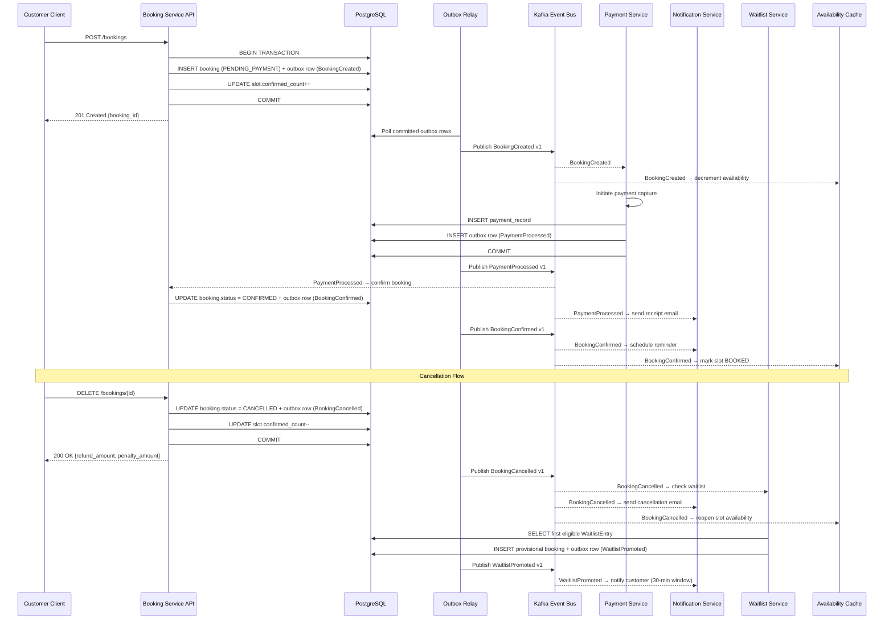

# Event Catalog — Slot Booking System

This catalog is the authoritative contract specification for all domain events published by the Slot Booking System. Every event listed here has a stable schema, versioning policy, SLO commitment, and defined producer and consumer relationships.

---

## Contract Conventions

### Naming

Events follow the pattern `<Aggregate><PastTenseAction>` in PascalCase (e.g., `BookingCreated`, `WaitlistPromoted`). The Kafka topic pattern is:

```
slot-booking.<aggregate>.<action>.<version>
```

Examples:
- `slot-booking.booking.created.v1`
- `slot-booking.slot.opened.v1`
- `slot-booking.payment.processed.v1`

### Envelope Schema

Every event is wrapped in a standard envelope regardless of payload type:

```json
{
  "event_id":        "uuid-v4",
  "event_type":      "BookingCreated",
  "schema_version":  "v1",
  "occurred_at":     "2024-03-15T10:30:00Z",
  "correlation_id":  "uuid-v4",
  "causation_id":    "uuid-v4",
  "producer":        "booking-service",
  "tenant_id":       "uuid-v4",
  "payload":         { }
}
```

| Field | Type | Description |
|-------|------|-------------|
| `event_id` | UUID v4 | Globally unique event identifier; used for consumer idempotency |
| `event_type` | String | PascalCase event name matching this catalog |
| `schema_version` | String | Semantic version of the payload schema (`v1`, `v2`, …) |
| `occurred_at` | ISO 8601 UTC | When the business fact occurred |
| `correlation_id` | UUID v4 | Propagated from the originating HTTP request; links all events in a saga |
| `causation_id` | UUID v4 | The `event_id` of the event that caused this event (null for command-originated events) |
| `producer` | String | Logical service name |
| `tenant_id` | UUID v4 | Multi-tenant isolation key |
| `payload` | Object | Event-specific payload; schema defined per event below |

### Delivery Guarantees

| Guarantee | Value |
|-----------|-------|
| **Delivery mode** | At-least-once via Kafka + outbox relay |
| **Ordering** | Per-partition; partitioned by `resource_id` or `booking_id` |
| **Consumer idempotency** | Mandatory; consumers deduplicate on `event_id` |
| **DLQ** | Failed events after 3 retries go to `slot-booking.<topic>.dlq` |
| **Schema compatibility** | Backward-compatible within major version; breaking changes bump version |

### Schema Evolution Policy

- **Additive changes** (new optional fields) are non-breaking and do not require a version bump.
- **Removals or type changes** require a new version (e.g., `v2`) and a deprecation window of minimum 30 days for the old version.
- Consumers must tolerate unknown fields (use `additionalProperties: true` in JSON Schema).

---

## Domain Events

| Event Name | Version | Payload Fields | Producer | Consumers | SLO (p95 publish latency) |
|------------|---------|---------------|----------|-----------|--------------------------|
| `SlotOpened` | v1 | `slot_id`, `resource_id`, `venue_id`, `start_time`, `end_time`, `price_amount`, `price_currency`, `capacity` | Slot Service | Availability Cache, Search Index, Notification Service | 3 s |
| `SlotClosed` | v1 | `slot_id`, `resource_id`, `reason` (`FULLY_BOOKED` / `BLOCKED` / `CANCELLED`), `closed_at` | Slot Service | Availability Cache, Search Index, Waitlist Service | 3 s |
| `BookingCreated` | v1 | `booking_id`, `customer_id`, `slot_ids[]`, `total_amount`, `currency`, `payment_mode`, `corporate_account_id?` | Booking Service | Payment Service, Notification Service, Analytics | 5 s |
| `BookingConfirmed` | v1 | `booking_id`, `customer_id`, `slot_ids[]`, `confirmed_at`, `payment_id` | Booking Service | Notification Service, Calendar Sync, Reporting | 5 s |
| `BookingCancelled` | v1 | `booking_id`, `customer_id`, `slot_ids[]`, `cancelled_at`, `cancelled_by`, `reason_code`, `refund_amount`, `penalty_amount` | Booking Service | Waitlist Service, Slot Service, Notification Service, Refund Service, Reporting | 5 s |
| `BookingNoShow` | v1 | `booking_id`, `customer_id`, `slot_id`, `no_show_recorded_at`, `cumulative_no_show_count`, `prepayment_required_triggered` | Booking Service | Customer Service, Notification Service, Reporting | 10 s |
| `WaitlistJoined` | v1 | `waitlist_id`, `slot_id`, `customer_id`, `position`, `priority`, `joined_at` | Waitlist Service | Notification Service, Analytics | 5 s |
| `WaitlistPromoted` | v1 | `waitlist_id`, `slot_id`, `customer_id`, `provisional_booking_id`, `confirm_by` (30-min deadline), `promoted_at` | Waitlist Service | Notification Service, Booking Service | 3 s |
| `PaymentProcessed` | v1 | `payment_id`, `booking_id`, `amount`, `currency`, `gateway`, `gateway_ref`, `status` (`CAPTURED` / `AUTHORIZED`), `processed_at` | Payment Service | Booking Service, Notification Service, Reporting, Ledger | 5 s |
| `RefundIssued` | v1 | `refund_id`, `payment_id`, `booking_id`, `amount`, `currency`, `reason_code`, `gateway_ref`, `status`, `initiated_at` | Payment Service (Refund sub-flow) | Notification Service, Reporting, Ledger | 5 s |
| `ReminderSent` | v1 | `notification_id`, `booking_id`, `customer_id`, `channel` (`EMAIL` / `SMS` / `PUSH`), `reminder_type` (`24H` / `1H`), `sent_at` | Notification Service | Analytics, Suppression Log | 10 s |
| `BlockApplied` | v1 | `block_id`, `resource_id`, `venue_id`, `start_time`, `end_time`, `block_reason`, `applied_by`, `applied_at` | Slot Service | Availability Cache, Notification Service (affected bookings), Reporting | 5 s |

---

## Payload Reference

### SlotOpened

```json
{
  "slot_id": "sl_abc123",
  "resource_id": "rs_xyz456",
  "venue_id": "vn_def789",
  "start_time": "2024-03-15T10:00:00Z",
  "end_time": "2024-03-15T11:00:00Z",
  "price_amount": "50.00",
  "price_currency": "USD",
  "capacity": 1
}
```

### BookingCreated

```json
{
  "booking_id": "bk_111aaa",
  "customer_id": "cu_222bbb",
  "slot_ids": ["sl_abc123"],
  "total_amount": "50.00",
  "currency": "USD",
  "payment_mode": "ONLINE",
  "corporate_account_id": null
}
```

### BookingCancelled

```json
{
  "booking_id": "bk_111aaa",
  "customer_id": "cu_222bbb",
  "slot_ids": ["sl_abc123"],
  "cancelled_at": "2024-03-14T08:00:00Z",
  "cancelled_by": "cu_222bbb",
  "reason_code": "CUSTOMER_REQUEST",
  "refund_amount": "25.00",
  "penalty_amount": "25.00"
}
```

### WaitlistPromoted

```json
{
  "waitlist_id": "wl_333ccc",
  "slot_id": "sl_abc123",
  "customer_id": "cu_444ddd",
  "provisional_booking_id": "bk_555eee",
  "confirm_by": "2024-03-14T08:30:00Z",
  "promoted_at": "2024-03-14T08:00:00Z"
}
```

### PaymentProcessed

```json
{
  "payment_id": "py_666fff",
  "booking_id": "bk_111aaa",
  "amount": "50.00",
  "currency": "USD",
  "gateway": "STRIPE",
  "gateway_ref": "pi_3OAbCdEfGhIjKl",
  "status": "CAPTURED",
  "processed_at": "2024-03-14T07:05:00Z"
}
```

---

## Publish and Consumption Sequence

The following sequence illustrates the full booking-to-confirmation event flow using the transactional outbox pattern:



---

## Operational SLOs

| SLO | Target | Measurement |
|-----|--------|-------------|
| **Tier-1 event publish latency p95** | ≤ 5 s from DB commit to Kafka delivery | Outbox relay monitoring |
| **Tier-2 event publish latency p95** | ≤ 10 s from DB commit to Kafka delivery | Outbox relay monitoring |
| **Consumer processing latency p95** | ≤ 10 s for Notification Service | Consumer lag metric |
| **DLQ triage SLA** | ≤ 15 min acknowledgement in business hours | PagerDuty alert |
| **Event loss rate** | 0% (zero data loss guarantee via outbox) | Outbox reconciliation job |
| **Schema validation failure rate** | < 0.01% of published events | Schema Registry metrics |
| **Idempotency collision rate** | < 0.001% of consumed events | Consumer dedup store metrics |

### Tier Classification

| Tier | Events | Rationale |
|------|--------|-----------|
| **Tier-1** (5 s SLO) | `BookingCreated`, `BookingConfirmed`, `BookingCancelled`, `WaitlistPromoted`, `PaymentProcessed`, `RefundIssued`, `SlotOpened`, `SlotClosed`, `BlockApplied` | Revenue and availability-critical; customer-visible latency impact |
| **Tier-2** (10 s SLO) | `BookingNoShow`, `WaitlistJoined`, `ReminderSent` | Operational and analytics; slight delay acceptable |

---

## Dead Letter Queue Handling

Events that exceed the retry policy (3 attempts with exponential backoff starting at 1 s) are routed to the DLQ topic `slot-booking.<original-topic>.dlq` with the following additional fields:

```json
{
  "dlq_reason": "CONSUMER_EXCEPTION",
  "dlq_exception": "java.lang.NullPointerException: ...",
  "dlq_retry_count": 3,
  "dlq_first_failed_at": "2024-03-15T10:35:00Z",
  "dlq_last_failed_at": "2024-03-15T10:35:12Z",
  "original_event": { ... }
}
```

The on-call engineer must:
1. Identify the root cause from `dlq_exception`.
2. Fix the consumer or data issue.
3. Re-publish from DLQ using the `slot-booking-dlq-replayer` job.
4. Verify idempotency to ensure no duplicate business effects.

---

## Event Schema Registry

All event schemas are stored in the Confluent Schema Registry under the subject naming convention `slot-booking-<aggregate>-<action>-v<N>-value`. Producers validate payloads against the registered schema before publishing. Schema ID is embedded in the Kafka message header `schema_id` for consumers to fetch the correct deserializer.
