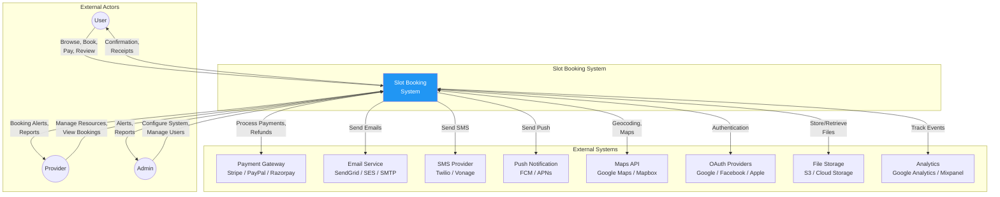
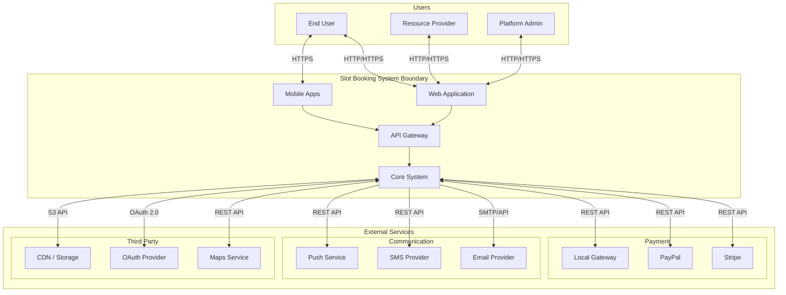
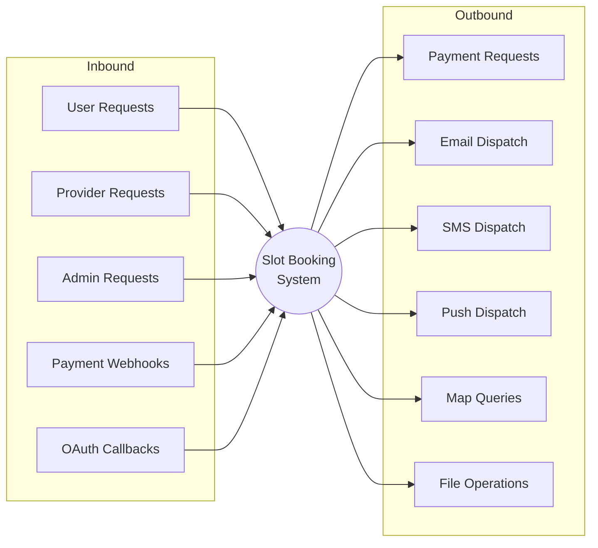
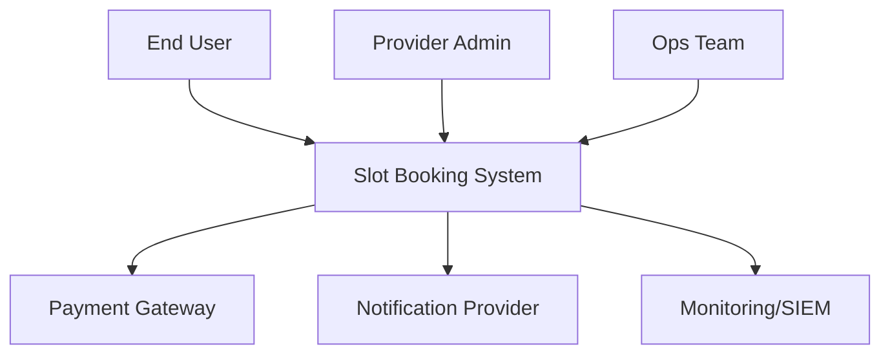

# System Context Diagram - Slot Booking System

> **Platform Independence**: External systems shown are representative; actual integrations depend on deployment.

---

## Overview

The System Context Diagram shows the Slot Booking System (the system under design) and its interactions with external actors and systems.

---

## System Context Diagram

---

## Detailed Context with Data Flows

---

## External System Details

| System | Purpose | Protocol | Data Exchanged |
|--------|---------|----------|----------------|
| **Payment Gateway** | Process payments, refunds | REST API | Payment requests, transaction status, webhooks |
| **Email Service** | Transactional emails | SMTP/REST | Booking confirmations, receipts, notifications |
| **SMS Provider** | SMS notifications, OTP | REST API | Text messages, delivery status |
| **Push Service** | Mobile push notifications | REST API | Push messages, device tokens |
| **Maps API** | Location services | REST API | Geocoding, map tiles, directions |
| **OAuth Providers** | Social authentication | OAuth 2.0 | User identity, profile data |
| **File Storage** | Store images, documents | S3/REST | Resource images, invoices |
| **Analytics** | Usage tracking | JavaScript/REST | User events, page views |

---

## System Boundaries

### What's Inside the System
- User registration and authentication
- Resource and slot management
- Booking lifecycle management
- Payment orchestration
- Notification dispatching
- Reporting and analytics aggregation
- Admin configuration

### What's Outside the System
- Actual payment processing (delegated to gateways)
- Email/SMS delivery (delegated to providers)
- File storage (delegated to cloud storage)
- Map rendering (delegated to map services)
- Identity verification (delegated to OAuth providers)

---

## Integration Points

---

## Trust Boundaries

| Boundary | Inside | Outside | Protection |
|----------|--------|---------|------------|
| **Public Internet** | External Users | System | TLS, WAF, Rate Limiting |
| **API Gateway** | Internal Services | External APIs | API Keys, OAuth |
| **Database Layer** | Application | Data Store | Connection Encryption, RBAC |
| **Payment Zone** | System | Payment Gateway | PCI DSS, Tokenization |

---
## Implementation-Ready System Context Diagram

### Slot allocation rules in this document's context
- Allocation decisions must be based on **resource calendar + operational policy + channel limits** before any payment action is attempted.
- All provisional allocations require an explicit **hold record with expiry**, and expiry must be visible to clients.
- Shared-capacity resources must use atomic decrement semantics; exclusive resources must enforce single-active-booking constraints.

### Conflict resolution in this document's context
- Competing writes must use deterministic conflict handling (optimistic version checks or transactional locks as documented here).
- API and admin paths must converge on one canonical conflict reason taxonomy (`SLOT_TAKEN`, `STALE_VERSION`, `PROVIDER_BLOCKED`, `PAYMENT_STATE_MISMATCH`).
- Every conflict rejection must emit structured audit telemetry including actor, correlation ID, and rule version.

### Payment coupling / decoupling behavior
- **Coupled flow**: booking moves to confirmed only after successful authorization/capture.
- **Decoupled flow**: booking can be confirmed with `PAYMENT_PENDING`, but with a bounded grace window and auto-cancel guardrail.
- Compensation is mandatory for split-brain outcomes (payment succeeded but booking failed, or inverse).

### Cancellation and refund policy detail
- Refund outcomes depend on lead time, policy tier, no-show status, and jurisdiction-specific fee constraints.
- Refund processing must be idempotent and expose lifecycle states (`REQUESTED`, `INITIATED`, `SETTLED`, `FAILED`, `MANUAL_REVIEW`).
- Cancellation side effects must include slot reallocation and downstream notification consistency.

### Observability and incident playbook focus
- Monitor: availability latency, hold expiry lag, conflict rate, payment callback success, refund aging.
- Alerts must map to operator runbooks with first-response steps and data reconciliation queries.
- Post-incident review must record policy gaps and required control changes for this documentation area.

### Analysis deliverables needed for implementation
- Actor-to-policy mapping (who can override, who can cancel, who can force-refund).
- Event semantics (`HoldCreated`, `BookingConfirmed`, `PaymentFailed`, `RefundSettled`) with producer/consumer contracts.
- Failure scenario catalog with expected user-visible outcomes and operator responsibilities.

### Mermaid system context dependencies

