# Use Case Diagram — Slot Booking System

This diagram captures the complete set of system interactions available to each actor in the Slot Booking System.

---

## Actors

| Actor | Type | Description |
|-------|------|-------------|
| **Guest** | External Primary | Unauthenticated user browsing resources |
| **Customer** | External Primary | Registered user making and managing bookings |
| **Corporate User** | External Primary | Customer linked to a corporate account |
| **Staff** | External Primary | Venue employee managing check-ins |
| **Venue Admin** | External Primary | Venue owner or manager |
| **Corporate Admin** | External Primary | Manager of a corporate account |
| **Platform Admin** | External Primary | System operator with full privileges |
| **Payment Gateway** | External Secondary | Stripe; processes charges and refunds |
| **Notification Provider** | External Secondary | Twilio/SendGrid; delivers SMS and email |
| **Background Job Scheduler** | Internal Secondary | Cron/Kubernetes CronJob; triggers no-show checks, slot generation, reminders |

---

## Use Case Diagram

```mermaid
graph TB
    Guest((Guest))
    Cust((Customer))
    CorpUser((Corporate\nUser))
    Staff((Staff))
    VA((Venue\nAdmin))
    CA((Corporate\nAdmin))
    PA((Platform\nAdmin))
    PGW((Payment\nGateway))
    NP((Notification\nProvider))
    Sched((Job\nScheduler))

    subgraph Authentication
        UC_REG[Register Account]
        UC_LOGIN[Login]
        UC_RESET[Reset Password]
        UC_MFA[Multi-Factor Auth]
        UC_PROFILE[Manage Profile]
    end

    subgraph Resource Discovery
        UC_SEARCH[Search Resources]
        UC_VIEW[View Resource Detail]
        UC_AVAIL[Check Slot Availability]
        UC_REVIEW[Read Reviews]
    end

    subgraph Booking Lifecycle
        UC_BOOK[Create Booking]
        UC_MULTI[Book Multiple Slots]
        UC_RECUR[Setup Recurring Booking]
        UC_VIEW_BK[View My Bookings]
        UC_CANCEL[Cancel Booking]
        UC_RESCHEDULE[Reschedule Booking]
        UC_WAITLIST[Join Waitlist]
        UC_WITHDRAW[Withdraw from Waitlist]
    end

    subgraph Payment
        UC_PAY[Process Payment]
        UC_REFUND[Receive Refund]
        UC_PROMO[Apply Promo Code]
        UC_RECEIPT[Download Receipt]
    end

    subgraph Staff Workflows
        UC_SCHEDULE[View Daily Schedule]
        UC_CHECKIN[Check In Customer]
        UC_NOSH[Record No-Show]
    end

    subgraph Venue Administration
        UC_CREATE_RES[Create Resource & Schedule]
        UC_BLOCK[Apply Block Rule]
        UC_SLOTS_GEN[Generate Slots]
        UC_PRICING[Configure Pricing]
        UC_ASSIGN_STAFF[Assign Staff to Slot]
        UC_REPORTS[View Occupancy Reports]
        UC_MANUAL_BK[Manual Admin Booking]
    end

    subgraph Corporate Management
        UC_QUOTA[Manage Quota]
        UC_APPROVE[Approve Excess Booking]
        UC_TEAM_RPT[View Team Usage]
    end

    subgraph Platform Administration
        UC_OVERRIDE[Apply Rule Override]
        UC_FORCE_MAJ[Declare Force Majeure]
        UC_SYS_CONFIG[System Configuration]
        UC_ANALYTICS[Cross-Venue Analytics]
        UC_AUDIT[View Audit Trail]
    end

    subgraph Automated Processes
        UC_AUTO_WAIT[Auto-Promote Waitlist]
        UC_AUTO_NOSH[Auto-Mark No-Show]
        UC_AUTO_REMIND[Send Reminders]
        UC_AUTO_GEN[Rolling Slot Generation]
        UC_EXPIRY[Expire Provisional Bookings]
    end

    Guest --> UC_SEARCH
    Guest --> UC_VIEW
    Guest --> UC_AVAIL
    Guest --> UC_REVIEW
    Guest --> UC_REG
    Guest --> UC_LOGIN

    Cust --> UC_SEARCH
    Cust --> UC_VIEW
    Cust --> UC_AVAIL
    Cust --> UC_BOOK
    Cust --> UC_MULTI
    Cust --> UC_RECUR
    Cust --> UC_VIEW_BK
    Cust --> UC_CANCEL
    Cust --> UC_RESCHEDULE
    Cust --> UC_WAITLIST
    Cust --> UC_WITHDRAW
    Cust --> UC_PAY
    Cust --> UC_REFUND
    Cust --> UC_PROMO
    Cust --> UC_RECEIPT
    Cust --> UC_PROFILE
    Cust --> UC_RESET

    CorpUser --> UC_BOOK
    CorpUser --> UC_MULTI
    CorpUser --> UC_CANCEL
    CorpUser --> UC_VIEW_BK

    Staff --> UC_SCHEDULE
    Staff --> UC_CHECKIN
    Staff --> UC_NOSH
    Staff --> UC_LOGIN

    VA --> UC_CREATE_RES
    VA --> UC_BLOCK
    VA --> UC_SLOTS_GEN
    VA --> UC_PRICING
    VA --> UC_ASSIGN_STAFF
    VA --> UC_REPORTS
    VA --> UC_MANUAL_BK
    VA --> UC_MFA

    CA --> UC_QUOTA
    CA --> UC_APPROVE
    CA --> UC_TEAM_RPT

    PA --> UC_OVERRIDE
    PA --> UC_FORCE_MAJ
    PA --> UC_SYS_CONFIG
    PA --> UC_ANALYTICS
    PA --> UC_AUDIT
    PA --> UC_MFA

    UC_PAY --> PGW
    UC_REFUND --> PGW
    UC_AUTO_REMIND --> NP
    UC_AUTO_WAIT --> NP
    UC_CANCEL --> NP

    Sched --> UC_AUTO_WAIT
    Sched --> UC_AUTO_NOSH
    Sched --> UC_AUTO_REMIND
    Sched --> UC_AUTO_GEN
    Sched --> UC_EXPIRY
```

---

## Use Case Summary

| # | Use Case | Primary Actor | Priority |
|---|----------|--------------|---------|
| 1 | Create Booking | Customer | Must Have |
| 2 | Cancel Booking | Customer | Must Have |
| 3 | Check Slot Availability | Guest / Customer | Must Have |
| 4 | Process Payment | Customer + Payment Gateway | Must Have |
| 5 | Auto-Promote Waitlist | Job Scheduler | Must Have |
| 6 | Auto-Mark No-Show | Job Scheduler | Must Have |
| 7 | Create Resource & Schedule | Venue Admin | Must Have |
| 8 | Apply Block Rule | Venue Admin | Must Have |
| 9 | Apply Rule Override | Platform Admin | Must Have |
| 10 | Setup Recurring Booking | Customer | Should Have |
| 11 | Manage Corporate Quota | Corporate Admin | Should Have |
| 12 | View Occupancy Reports | Venue Admin | Should Have |
