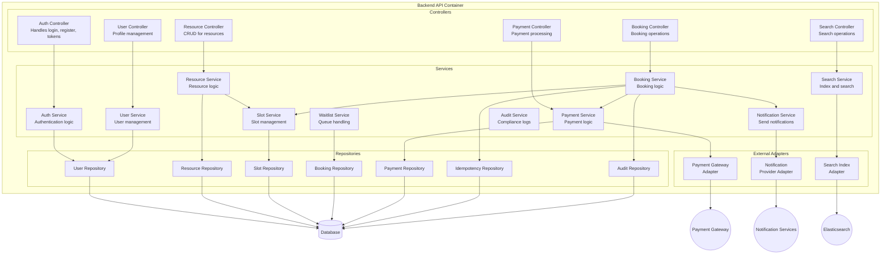
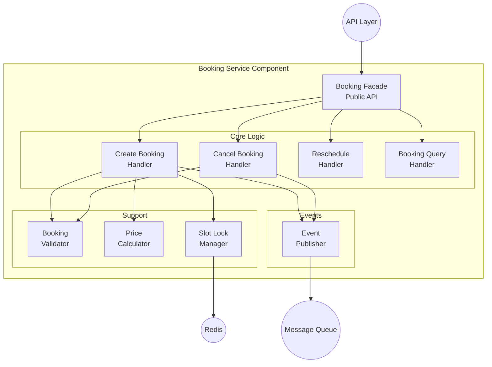
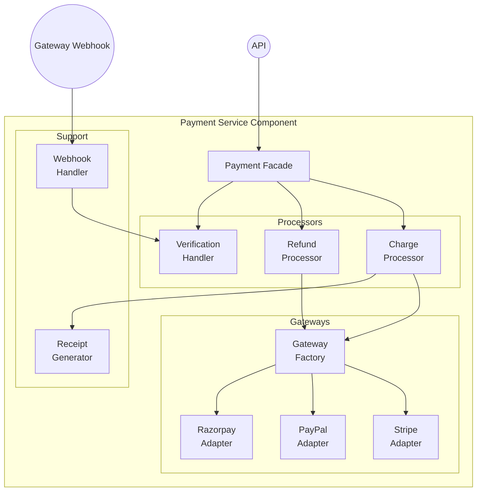
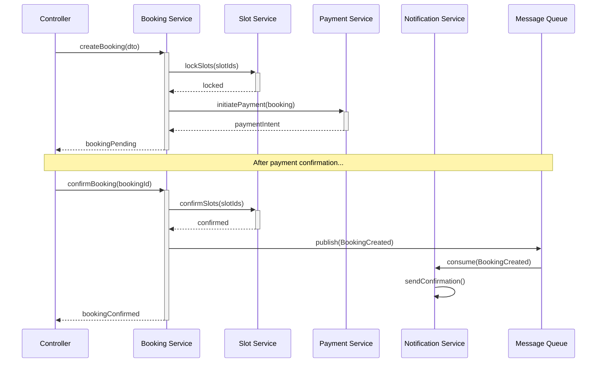
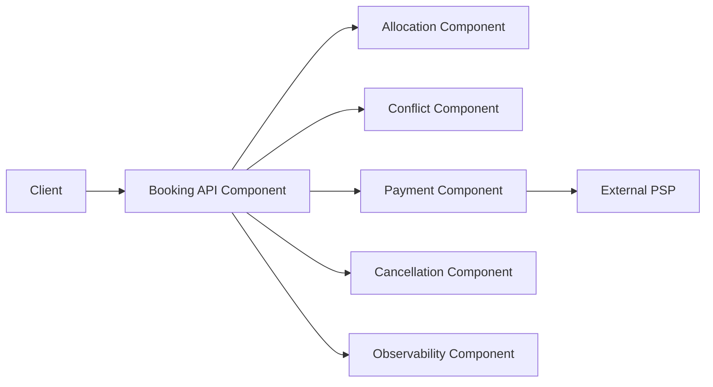

# C4 Component Diagram - Slot Booking System

> **Platform Independence**: C4 Level 3 showing components within containers.

---

## Overview

The C4 Component Diagram (Level 3) shows the internal structure of containers, breaking them down into components.

---

## Backend API Container - Components

---

## Booking Service Component Detail

---

## Payment Service Component Detail

---

## Component Responsibilities

| Component | Responsibility | Interfaces |
|-----------|----------------|------------|
| **Auth Controller** | Handle auth HTTP requests | REST endpoints |
| **Auth Service** | Token generation, validation | IAuthService |
| **User Service** | User CRUD, profile mgmt | IUserService |
| **Resource Service** | Resource CRUD, image handling | IResourceService |
| **Slot Service** | Slot generation, locking | ISlotService |
| **Booking Service** | Booking lifecycle | IBookingService |
| **Payment Service** | Payment orchestration | IPaymentService |
| **Notification Service** | Multi-channel dispatch | INotificationService |
| **Search Service** | Indexing, searching | ISearchService |

---

## Component Interaction Example

---

## Technology Mapping

| Component | Technology Options |
|-----------|-------------------|
| Controllers | Express.js, FastAPI, Spring MVC |
| Services | TypeScript classes, Python classes |
| Repositories | TypeORM, Prisma, SQLAlchemy |
| Event Publisher | RabbitMQ client, Kafka producer |
| Payment Adapters | Stripe SDK, PayPal SDK |
| Notification Adapters | SendGrid SDK, Twilio SDK |

---
## Implementation-Ready C4 Component

### Slot allocation rules in this document's context
- Allocation decisions must be based on **resource calendar + operational policy + channel limits** before any payment action is attempted.
- All provisional allocations require an explicit **hold record with expiry**, and expiry must be visible to clients.
- Shared-capacity resources must use atomic decrement semantics; exclusive resources must enforce single-active-booking constraints.

### Conflict resolution in this document's context
- Competing writes must use deterministic conflict handling (optimistic version checks or transactional locks as documented here).
- API and admin paths must converge on one canonical conflict reason taxonomy (`SLOT_TAKEN`, `STALE_VERSION`, `PROVIDER_BLOCKED`, `PAYMENT_STATE_MISMATCH`).
- Every conflict rejection must emit structured audit telemetry including actor, correlation ID, and rule version.

### Payment coupling / decoupling behavior
- **Coupled flow**: booking moves to confirmed only after successful authorization/capture.
- **Decoupled flow**: booking can be confirmed with `PAYMENT_PENDING`, but with a bounded grace window and auto-cancel guardrail.
- Compensation is mandatory for split-brain outcomes (payment succeeded but booking failed, or inverse).

### Cancellation and refund policy detail
- Refund outcomes depend on lead time, policy tier, no-show status, and jurisdiction-specific fee constraints.
- Refund processing must be idempotent and expose lifecycle states (`REQUESTED`, `INITIATED`, `SETTLED`, `FAILED`, `MANUAL_REVIEW`).
- Cancellation side effects must include slot reallocation and downstream notification consistency.

### Observability and incident playbook focus
- Monitor: availability latency, hold expiry lag, conflict rate, payment callback success, refund aging.
- Alerts must map to operator runbooks with first-response steps and data reconciliation queries.
- Post-incident review must record policy gaps and required control changes for this documentation area.

### Detailed implementation contracts
- Transaction boundaries for hold, confirm, cancel, and refund actions.
- Outbox/inbox idempotency strategy for webhook and event replay safety.
- Data model constraints and indexes required to prevent overlap anomalies.

### Mermaid C4 component-level view

