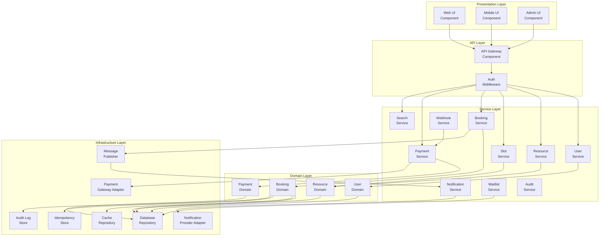
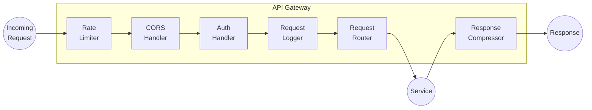
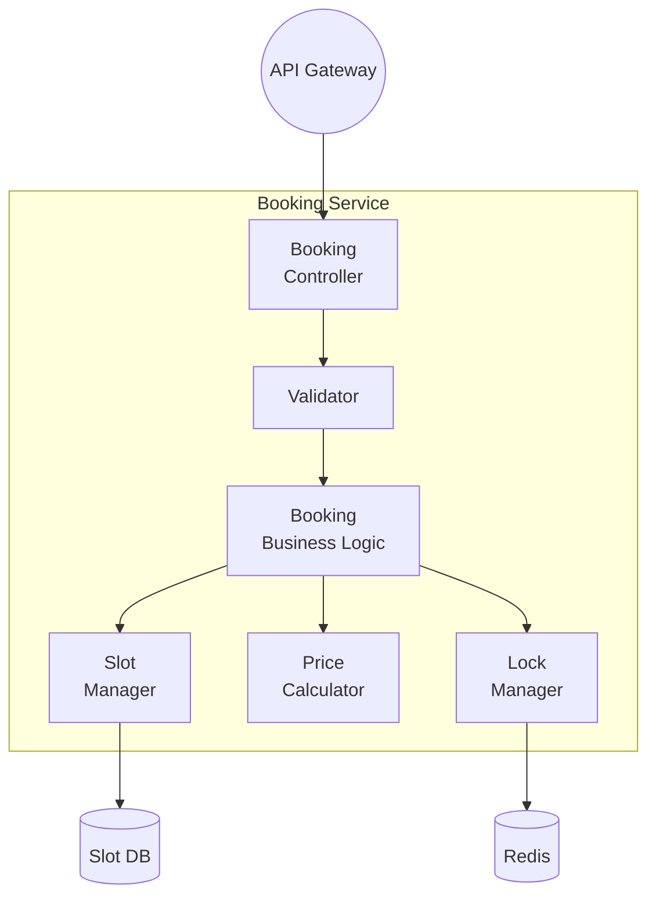
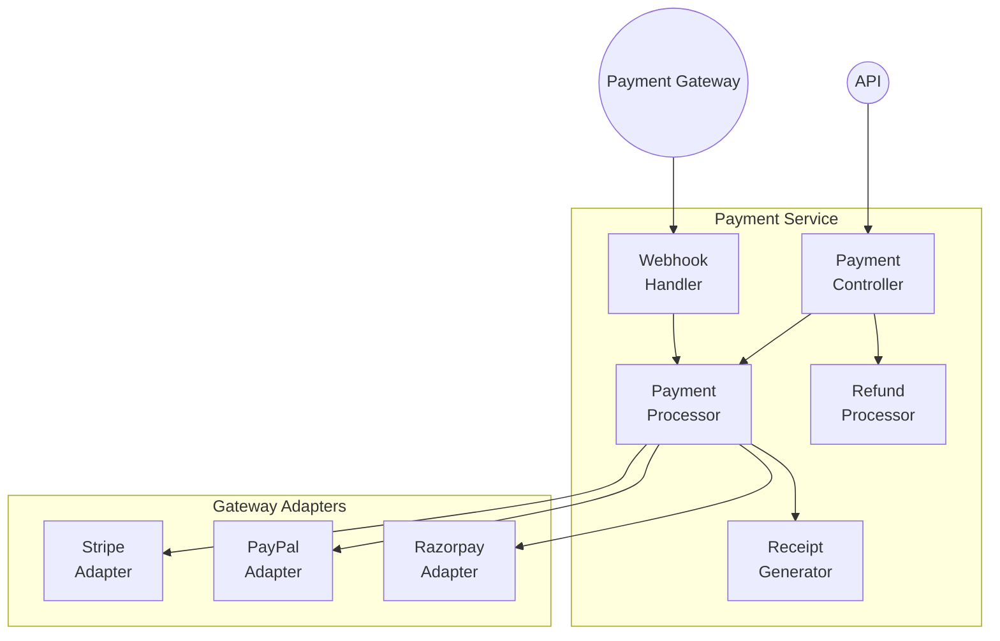
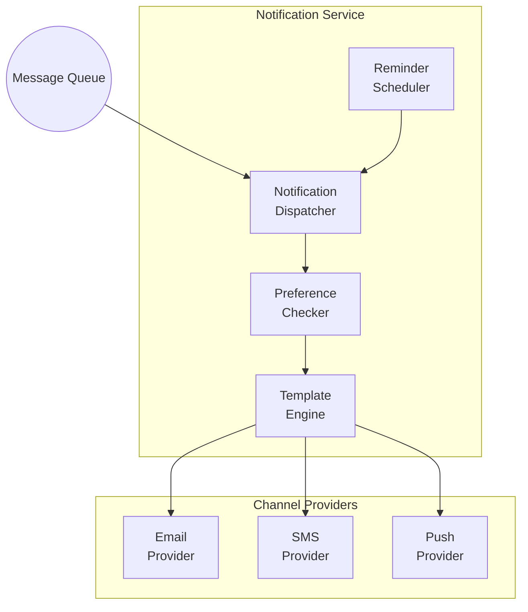
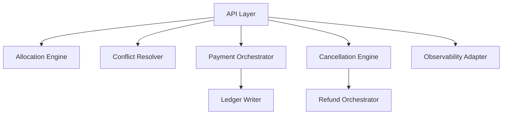

# Component Diagram - Slot Booking System

> **Platform Independence**: Shows software modules independent of technology choices.

---

## Overview

The Component Diagram shows how the system is divided into software components and their dependencies.

---

## High-Level Component View



---

## Detailed Component Breakdown

### API Gateway Component



### Booking Service Components



### Payment Service Components



### Notification Service Components



---

## Component Dependencies Matrix

| Component | Depends On | Depended By |
|-----------|------------|-------------|
| API Gateway | Auth Middleware | All Services |
| User Service | User Repository | Booking, Auth |
| Resource Service | Resource Repository, Slot Manager | Booking, Search |
| Booking Service | Slot, Payment, Notification | API Gateway |
| Payment Service | Gateway Adapters | Booking |
| Notification Service | Provider Adapters | All Services |
| Search Service | Search Index | API Gateway |

---

## Package/Module Structure

```
src/
├── api/
│   ├── controllers/
│   │   ├── auth.controller.ts
│   │   ├── booking.controller.ts
│   │   ├── payment.controller.ts
│   │   ├── resource.controller.ts
│   │   └── user.controller.ts
│   ├── middleware/
│   │   ├── auth.middleware.ts
│   │   ├── validation.middleware.ts
│   │   └── rate-limit.middleware.ts
│   └── routes/
│
├── services/
│   ├── booking.service.ts
│   ├── payment.service.ts
│   ├── notification.service.ts
│   ├── resource.service.ts
│   ├── search.service.ts
│   └── user.service.ts
│
├── domain/
│   ├── entities/
│   ├── value-objects/
│   ├── events/
│   └── services/
│
├── infrastructure/
│   ├── database/
│   │   ├── repositories/
│   │   └── migrations/
│   ├── cache/
│   ├── queue/
│   └── external/
│       ├── payment-gateways/
│       └── notification-providers/
│
└── shared/
    ├── utils/
    ├── constants/
    └── types/
```

---

## Interface Contracts

| Interface | Methods | Implemented By |
|-----------|---------|----------------|
| `IBookingService` | createBooking, cancelBooking, getBooking | BookingService |
| `IPaymentGateway` | charge, refund, verify | StripeAdapter, PayPalAdapter |
| `INotificationProvider` | send, sendBulk | EmailProvider, SMSProvider |
| `IRepository<T>` | find, save, update, delete | All Repositories |
| `ICacheService` | get, set, delete, lock | RedisCacheService |

---
## Implementation-Ready Component Diagram

### Slot allocation rules in this document's context
- Allocation decisions must be based on **resource calendar + operational policy + channel limits** before any payment action is attempted.
- All provisional allocations require an explicit **hold record with expiry**, and expiry must be visible to clients.
- Shared-capacity resources must use atomic decrement semantics; exclusive resources must enforce single-active-booking constraints.

### Conflict resolution in this document's context
- Competing writes must use deterministic conflict handling (optimistic version checks or transactional locks as documented here).
- API and admin paths must converge on one canonical conflict reason taxonomy (`SLOT_TAKEN`, `STALE_VERSION`, `PROVIDER_BLOCKED`, `PAYMENT_STATE_MISMATCH`).
- Every conflict rejection must emit structured audit telemetry including actor, correlation ID, and rule version.

### Payment coupling / decoupling behavior
- **Coupled flow**: booking moves to confirmed only after successful authorization/capture.
- **Decoupled flow**: booking can be confirmed with `PAYMENT_PENDING`, but with a bounded grace window and auto-cancel guardrail.
- Compensation is mandatory for split-brain outcomes (payment succeeded but booking failed, or inverse).

### Cancellation and refund policy detail
- Refund outcomes depend on lead time, policy tier, no-show status, and jurisdiction-specific fee constraints.
- Refund processing must be idempotent and expose lifecycle states (`REQUESTED`, `INITIATED`, `SETTLED`, `FAILED`, `MANUAL_REVIEW`).
- Cancellation side effects must include slot reallocation and downstream notification consistency.

### Observability and incident playbook focus
- Monitor: availability latency, hold expiry lag, conflict rate, payment callback success, refund aging.
- Alerts must map to operator runbooks with first-response steps and data reconciliation queries.
- Post-incident review must record policy gaps and required control changes for this documentation area.

### Detailed implementation contracts
- Transaction boundaries for hold, confirm, cancel, and refund actions.
- Outbox/inbox idempotency strategy for webhook and event replay safety.
- Data model constraints and indexes required to prevent overlap anomalies.


### Mermaid internal component responsibilities

