# Sequence Diagram - Slot Booking System

> **Platform Independence**: Shows internal object interactions applicable to any implementation.

---

## Overview

Sequence diagrams show detailed interactions between objects within the system, revealing internal implementation flow.

---

## SD-01: User Registration

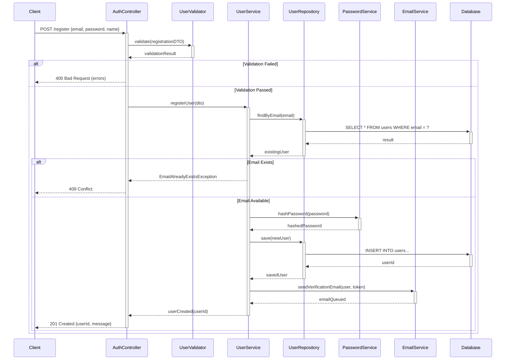

---

## SD-02: Complete Booking Flow

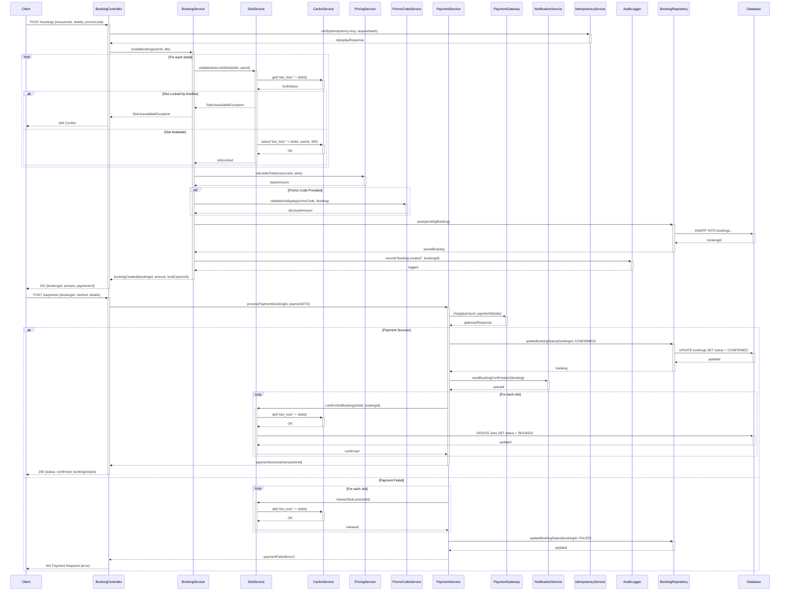

---

## SD-03: Cancel Booking with Refund

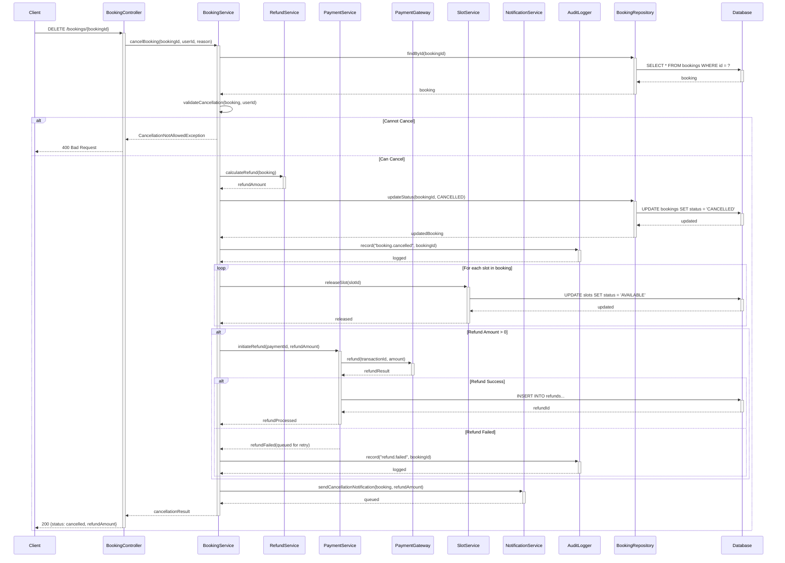

---

## SD-04: Resource Search

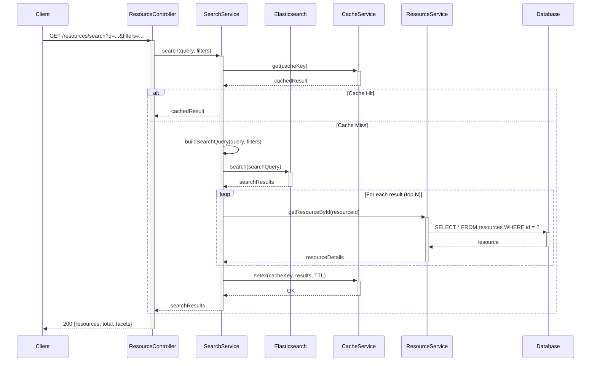

---

## SD-05: Provider Creates Resource

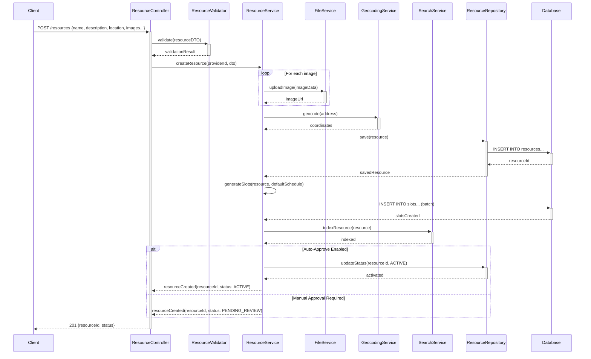

---

## SD-06: Send Booking Reminder

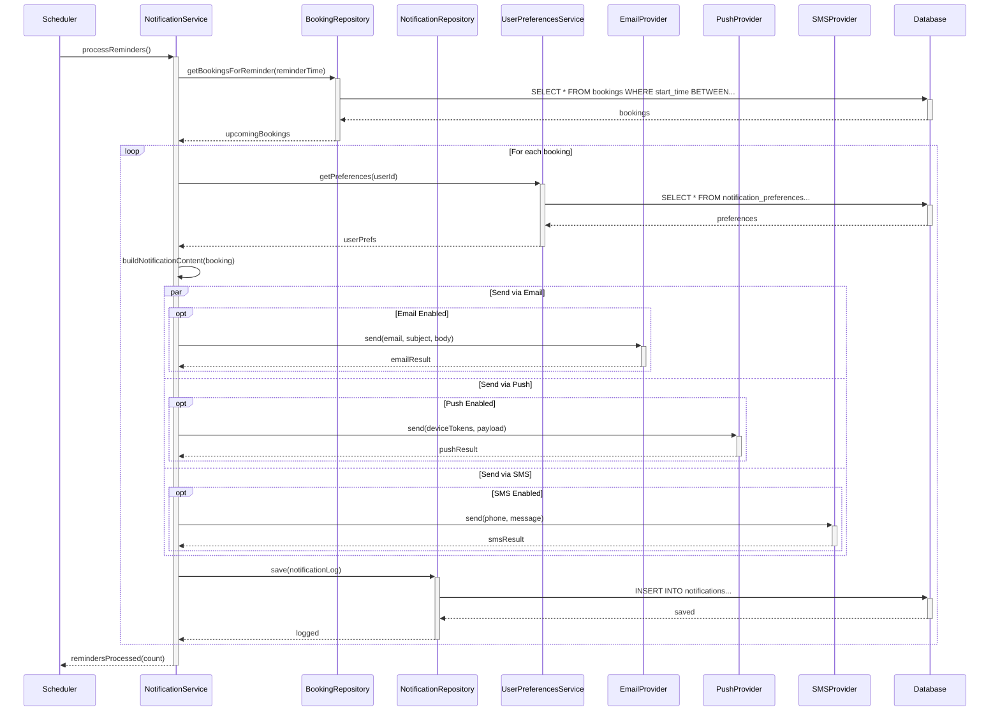

---

## SD-07: Handle Payment Webhook

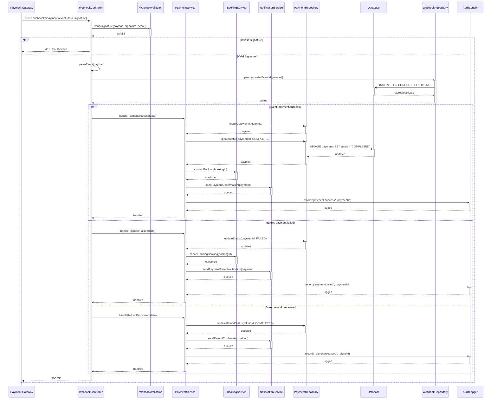

---

## Sequence Diagram Summary

| Diagram | Primary Flow | Key Components |
|---------|--------------|----------------|
| SD-01 | User Registration | AuthController, UserService, EmailService |
| SD-02 | Complete Booking | BookingService, SlotService, PaymentService, Cache |
| SD-03 | Cancel with Refund | BookingService, RefundService, SlotService |
| SD-04 | Resource Search | SearchService, Elasticsearch, Cache |
| SD-05 | Provider Creates Resource | ResourceService, FileService, GeocodingService |
| SD-06 | Booking Reminder | NotificationService, Scheduler, Providers |
| SD-07 | Payment Webhook | WebhookController, PaymentService, BookingService |

---
## Implementation-Ready Sequence Diagram

### Slot allocation rules in this document's context
- Allocation decisions must be based on **resource calendar + operational policy + channel limits** before any payment action is attempted.
- All provisional allocations require an explicit **hold record with expiry**, and expiry must be visible to clients.
- Shared-capacity resources must use atomic decrement semantics; exclusive resources must enforce single-active-booking constraints.

### Conflict resolution in this document's context
- Competing writes must use deterministic conflict handling (optimistic version checks or transactional locks as documented here).
- API and admin paths must converge on one canonical conflict reason taxonomy (`SLOT_TAKEN`, `STALE_VERSION`, `PROVIDER_BLOCKED`, `PAYMENT_STATE_MISMATCH`).
- Every conflict rejection must emit structured audit telemetry including actor, correlation ID, and rule version.

### Payment coupling / decoupling behavior
- **Coupled flow**: booking moves to confirmed only after successful authorization/capture.
- **Decoupled flow**: booking can be confirmed with `PAYMENT_PENDING`, but with a bounded grace window and auto-cancel guardrail.
- Compensation is mandatory for split-brain outcomes (payment succeeded but booking failed, or inverse).

### Cancellation and refund policy detail
- Refund outcomes depend on lead time, policy tier, no-show status, and jurisdiction-specific fee constraints.
- Refund processing must be idempotent and expose lifecycle states (`REQUESTED`, `INITIATED`, `SETTLED`, `FAILED`, `MANUAL_REVIEW`).
- Cancellation side effects must include slot reallocation and downstream notification consistency.

### Observability and incident playbook focus
- Monitor: availability latency, hold expiry lag, conflict rate, payment callback success, refund aging.
- Alerts must map to operator runbooks with first-response steps and data reconciliation queries.
- Post-incident review must record policy gaps and required control changes for this documentation area.

### Detailed implementation contracts
- Transaction boundaries for hold, confirm, cancel, and refund actions.
- Outbox/inbox idempotency strategy for webhook and event replay safety.
- Data model constraints and indexes required to prevent overlap anomalies.

### Mermaid saga sequence for confirm and compensation
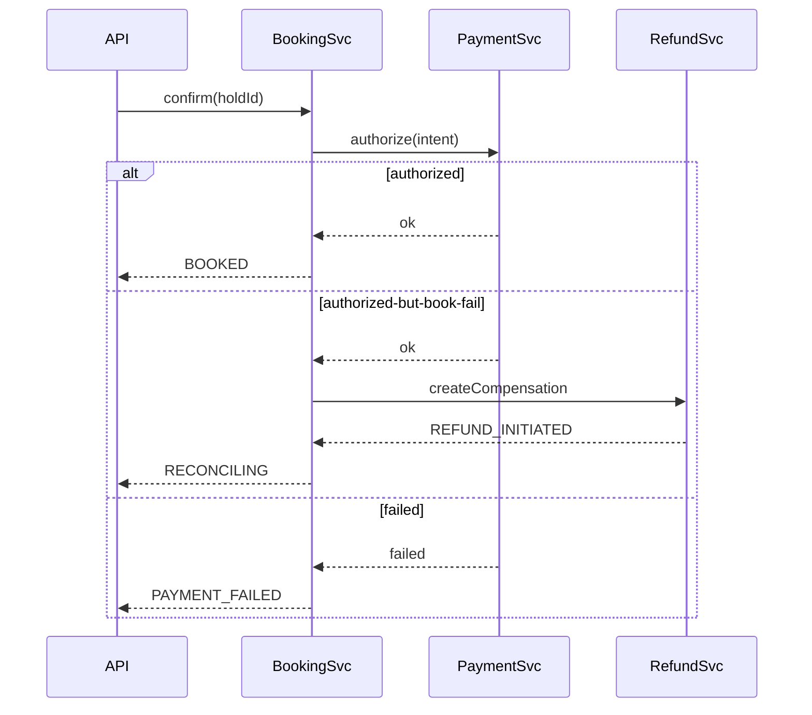

---

## SD-05: Reserve / Confirm / Cancel / Refund with Explicit Transaction Boundaries

### SD-05A: Reserve Slot (Hold Creation)

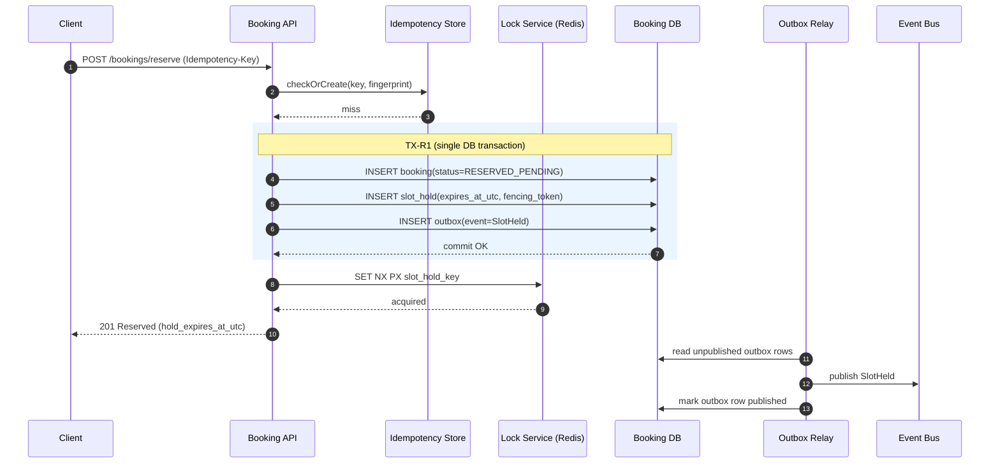

### SD-05B: Confirm Booking (Payment Coupled)

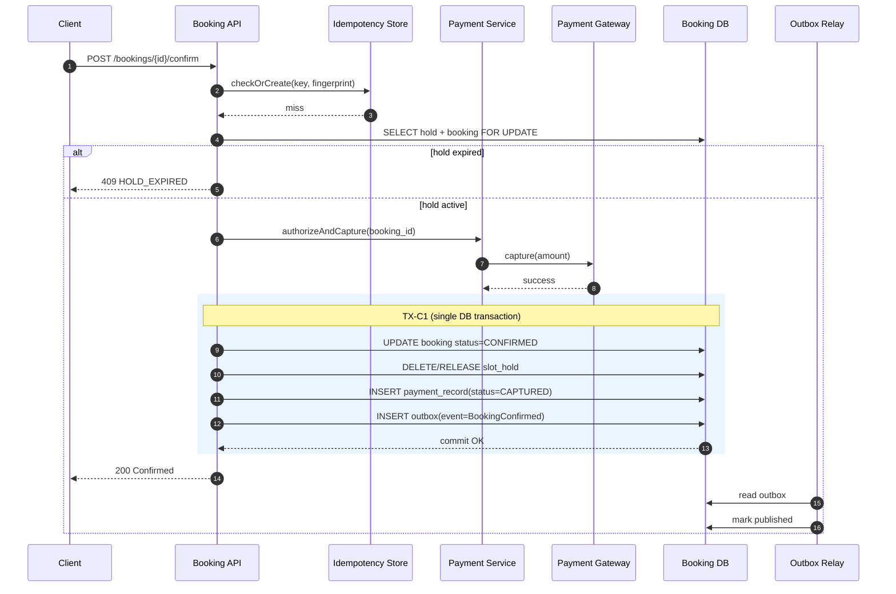

### SD-05C: Cancel Booking

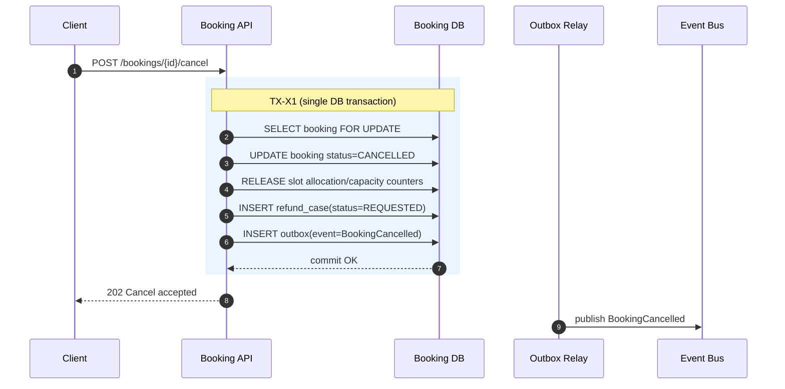

### SD-05D: Refund Processing

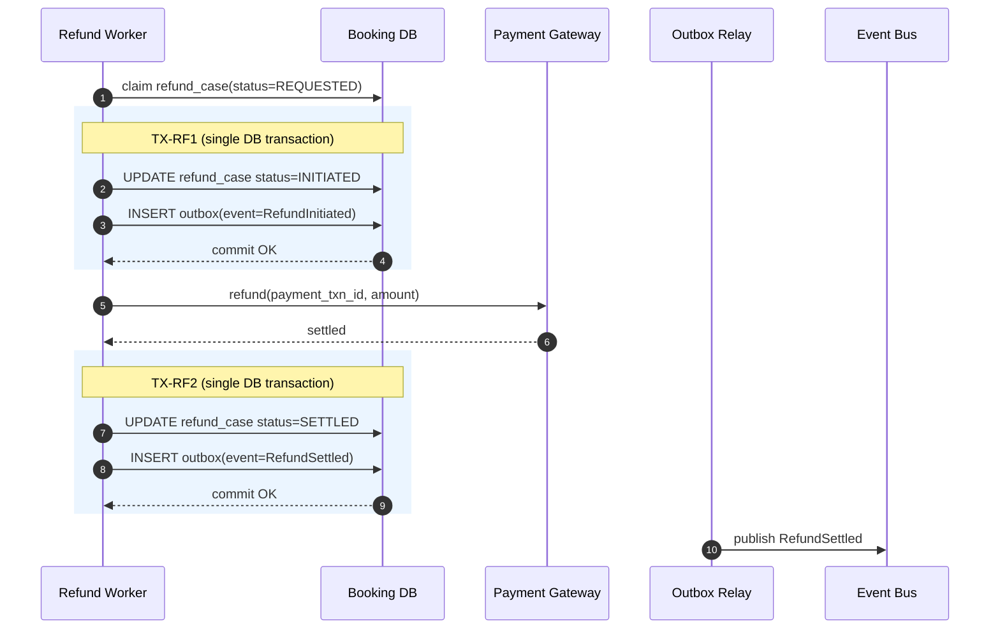
