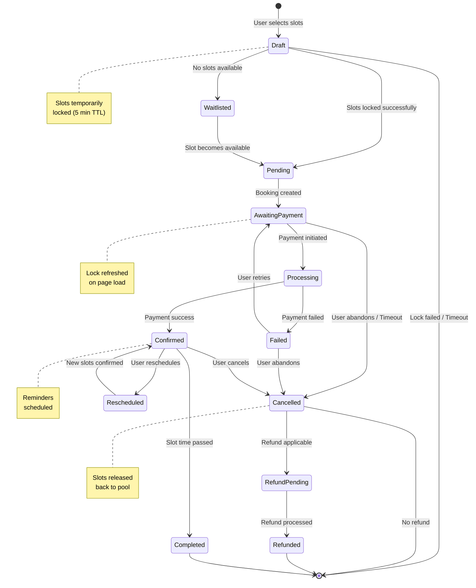
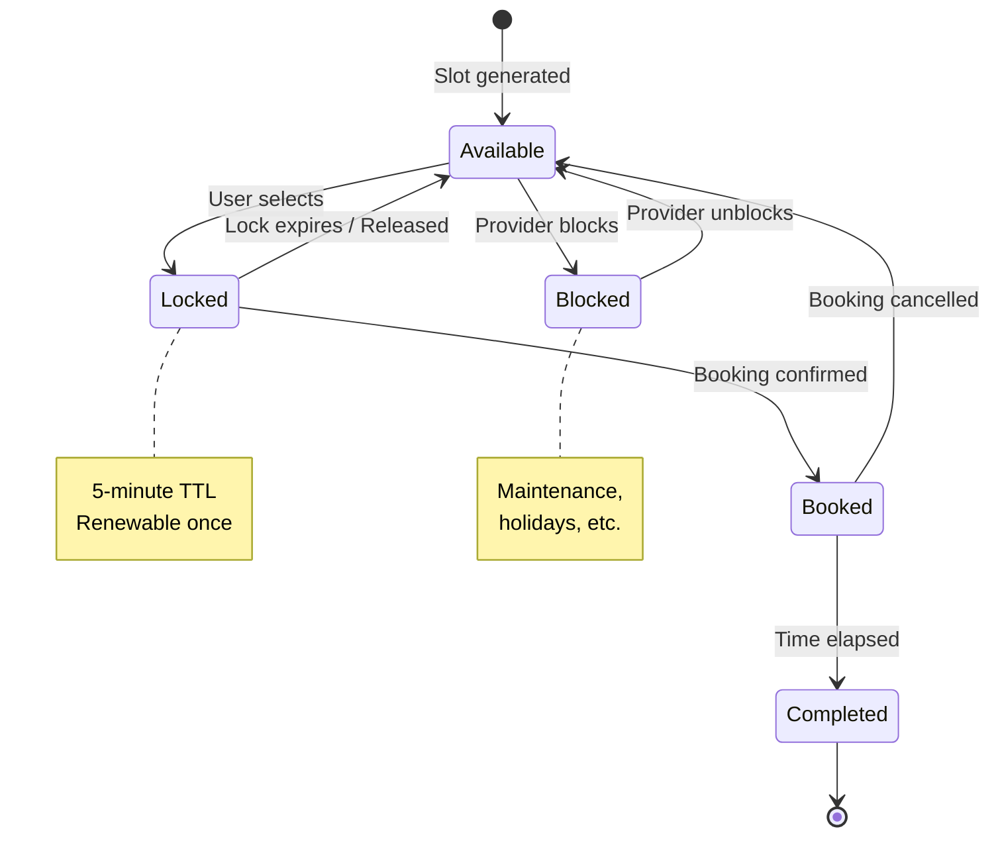
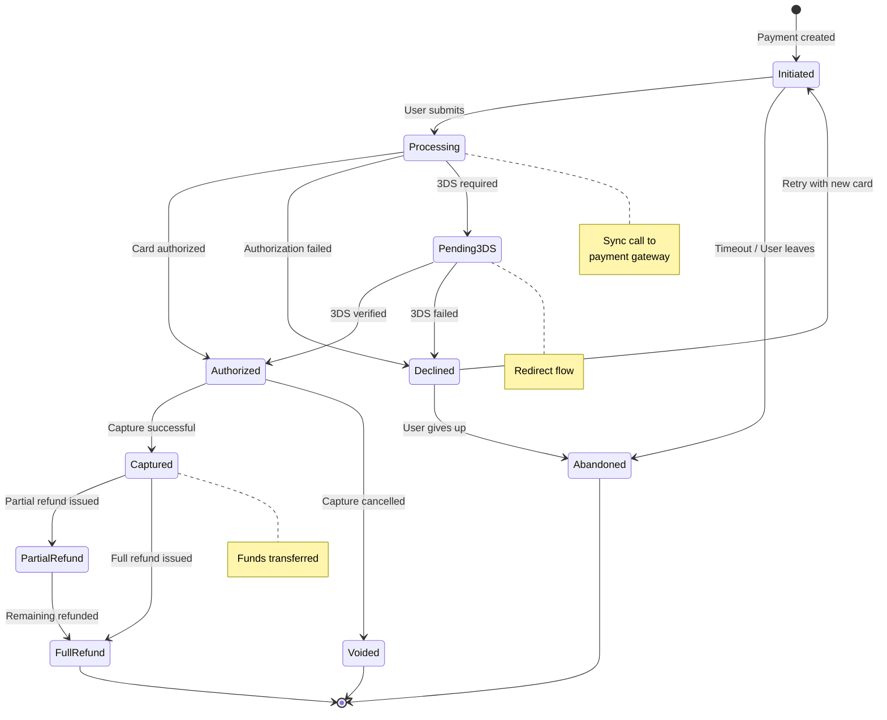
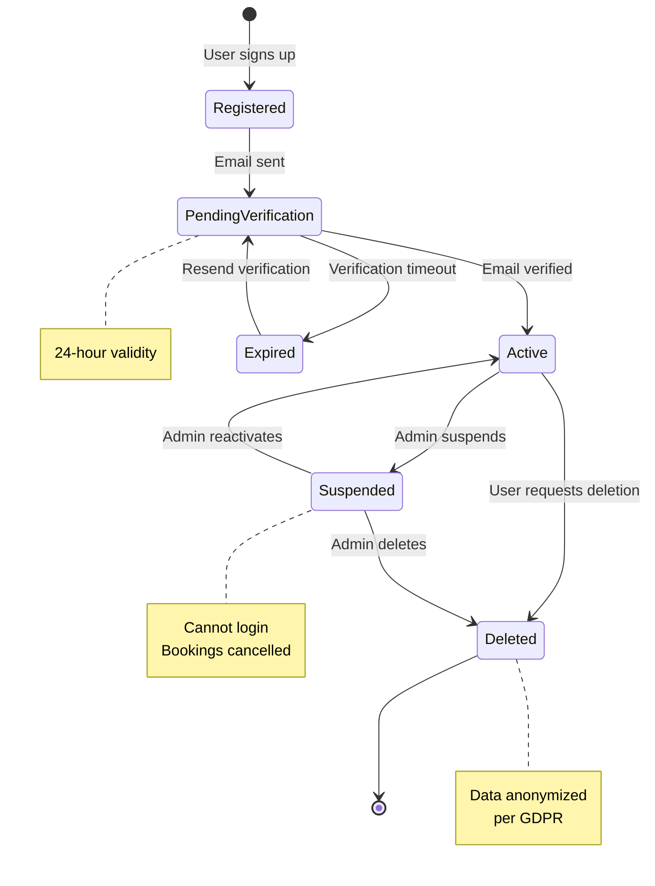
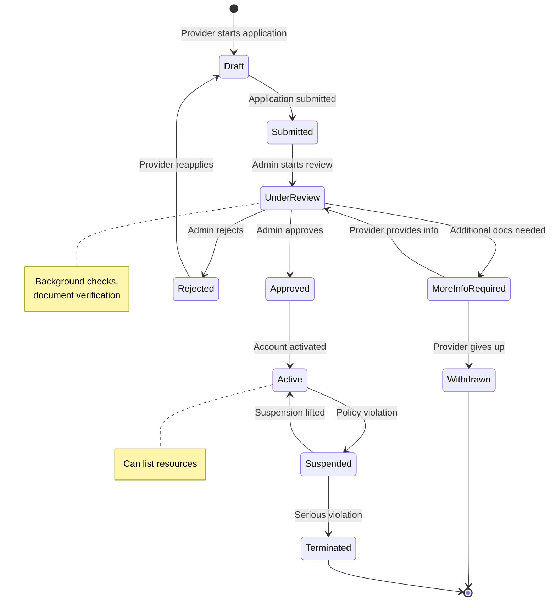
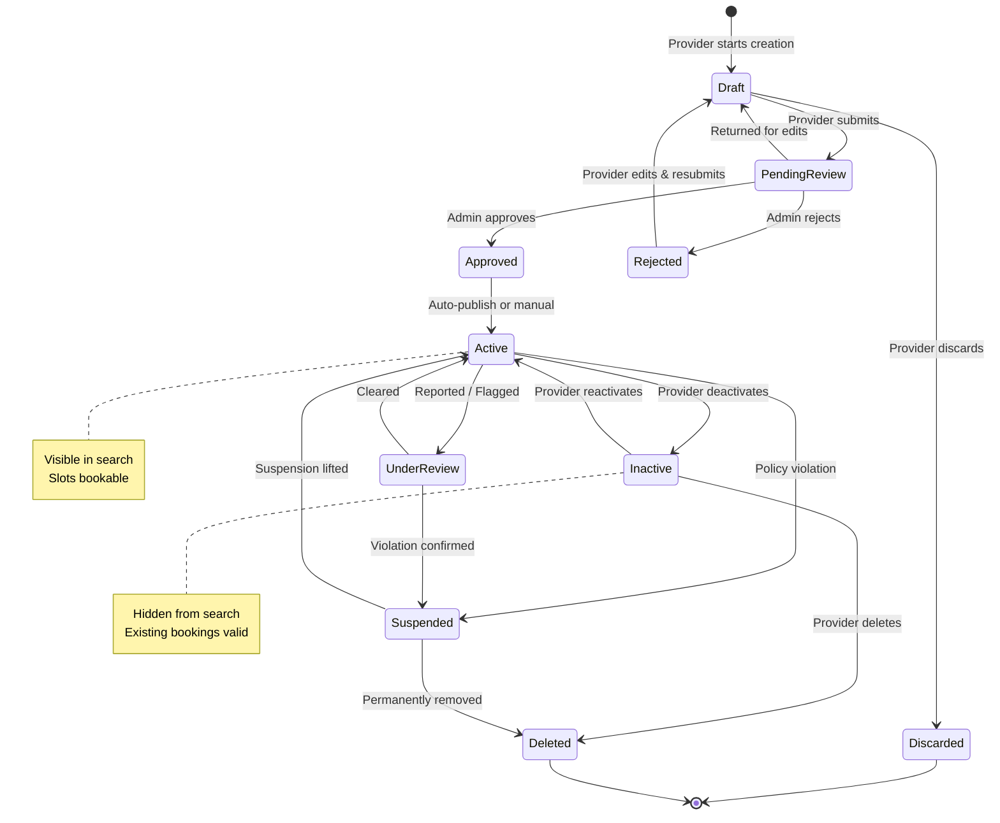
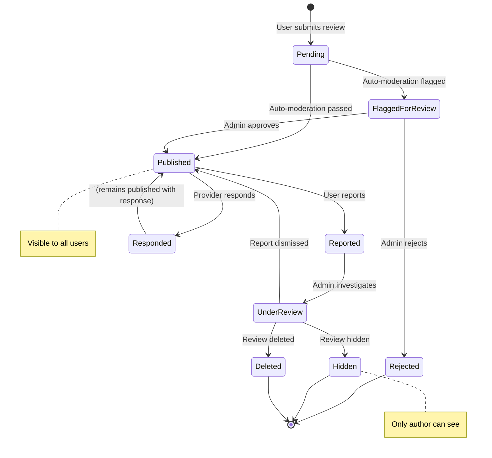
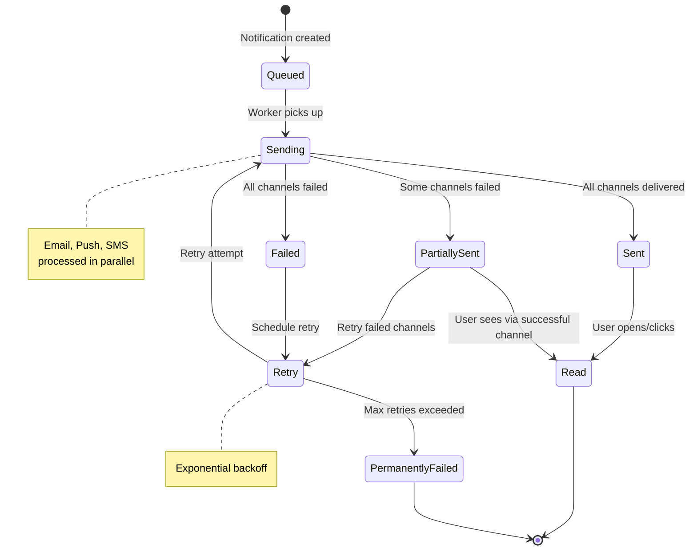
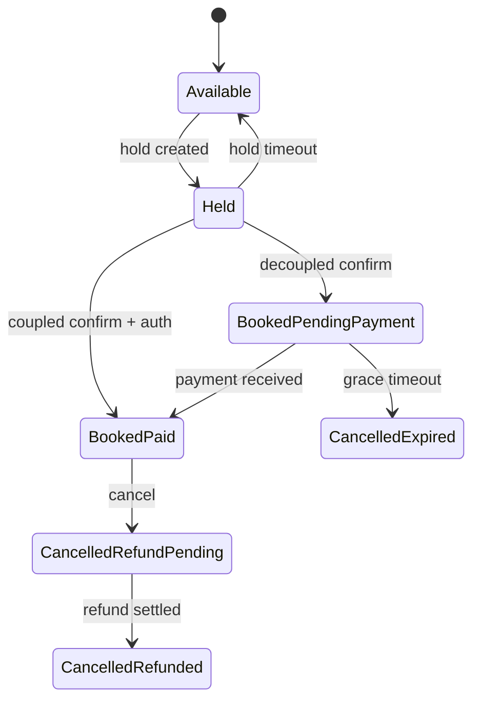

# State Machine Diagram - Slot Booking System

> **Platform Independence**: State machines show object lifecycle independent of implementation.

---

## Overview

State Machine Diagrams show how key entities transition through various states during their lifecycle.

---

## 1. Booking State Machine

### Booking States Description

| State | Description | Entry Action | Exit Action |
|-------|-------------|--------------|-------------|
| **Draft** | User is selecting slots | Lock selected slots | - |
| **Pending** | Booking record created | Create booking, start payment | - |
| **AwaitingPayment** | Waiting for user to pay | Show payment form | - |
| **Processing** | Payment being processed | Submit to gateway | - |
| **Confirmed** | Booking is active | Send confirmation, schedule reminders | - |
| **Completed** | Booking fulfilled | Request review | - |
| **Cancelled** | Booking cancelled | Release slots, calculate refund | - |
| **RefundPending** | Refund in progress | Initiate refund | - |
| **Refunded** | Refund completed | Send refund confirmation | - |
| **Failed** | Payment failed | Notify user | - |
| **Rescheduled** | Change in progress | Lock new slots | Release old slots |

---

## 2. Slot State Machine

### Slot States Description

| State | Description | Can Transition To |
|-------|-------------|-------------------|
| **Available** | Open for booking | Locked, Blocked |
| **Locked** | Temporarily held for user | Available, Booked |
| **Booked** | Confirmed reservation | Available, Completed |
| **Blocked** | Unavailable by provider | Available |
| **Completed** | Time has passed | (Terminal) |

---

## 3. Payment State Machine

### Payment States Description

| State | Description | Triggers |
|-------|-------------|----------|
| **Initiated** | Payment record created | Booking submission |
| **Processing** | Being processed | User confirms |
| **Pending3DS** | 3D Secure verification | Gateway requires |
| **Authorized** | Funds authorized | Gateway success |
| **Captured** | Funds transferred | Auto or manual capture |
| **Declined** | Payment rejected | Gateway decline |
| **Voided** | Authorization cancelled | Before capture |
| **PartialRefund** | Part of amount refunded | Partial cancellation |
| **FullRefund** | Full amount refunded | Full cancellation |
| **Abandoned** | User never completed | Timeout |

---

## 4. User Account State Machine

---

## 5. Provider Application State Machine

---

## 6. Resource State Machine

---

## 7. Review State Machine

---

## 8. Notification State Machine

---

## State Transition Events Summary

| Entity | Key Events | Business Impact |
|--------|-----------|-----------------|
| **Booking** | Created, Confirmed, Cancelled, Completed | Core revenue flow |
| **Slot** | Locked, Booked, Released | Inventory management |
| **Payment** | Authorized, Captured, Refunded | Financial transactions |
| **User** | Verified, Suspended, Deleted | Access control |
| **Provider** | Approved, Suspended, Terminated | Supply side |
| **Resource** | Published, Deactivated, Deleted | Catalog management |
| **Review** | Published, Reported, Hidden | Content moderation |
| **Notification** | Sent, Read, Failed | User communication |

---
## Implementation-Ready State Machine Diagram

### Slot allocation rules in this document's context
- Allocation decisions must be based on **resource calendar + operational policy + channel limits** before any payment action is attempted.
- All provisional allocations require an explicit **hold record with expiry**, and expiry must be visible to clients.
- Shared-capacity resources must use atomic decrement semantics; exclusive resources must enforce single-active-booking constraints.

### Conflict resolution in this document's context
- Competing writes must use deterministic conflict handling (optimistic version checks or transactional locks as documented here).
- API and admin paths must converge on one canonical conflict reason taxonomy (`SLOT_TAKEN`, `STALE_VERSION`, `PROVIDER_BLOCKED`, `PAYMENT_STATE_MISMATCH`).
- Every conflict rejection must emit structured audit telemetry including actor, correlation ID, and rule version.

### Payment coupling / decoupling behavior
- **Coupled flow**: booking moves to confirmed only after successful authorization/capture.
- **Decoupled flow**: booking can be confirmed with `PAYMENT_PENDING`, but with a bounded grace window and auto-cancel guardrail.
- Compensation is mandatory for split-brain outcomes (payment succeeded but booking failed, or inverse).

### Cancellation and refund policy detail
- Refund outcomes depend on lead time, policy tier, no-show status, and jurisdiction-specific fee constraints.
- Refund processing must be idempotent and expose lifecycle states (`REQUESTED`, `INITIATED`, `SETTLED`, `FAILED`, `MANUAL_REVIEW`).
- Cancellation side effects must include slot reallocation and downstream notification consistency.

### Observability and incident playbook focus
- Monitor: availability latency, hold expiry lag, conflict rate, payment callback success, refund aging.
- Alerts must map to operator runbooks with first-response steps and data reconciliation queries.
- Post-incident review must record policy gaps and required control changes for this documentation area.

### Detailed implementation contracts
- Transaction boundaries for hold, confirm, cancel, and refund actions.
- Outbox/inbox idempotency strategy for webhook and event replay safety.
- Data model constraints and indexes required to prevent overlap anomalies.

### Mermaid composite booking/payment states

