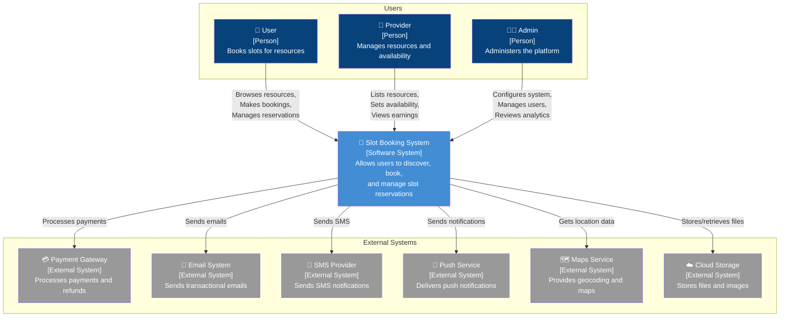
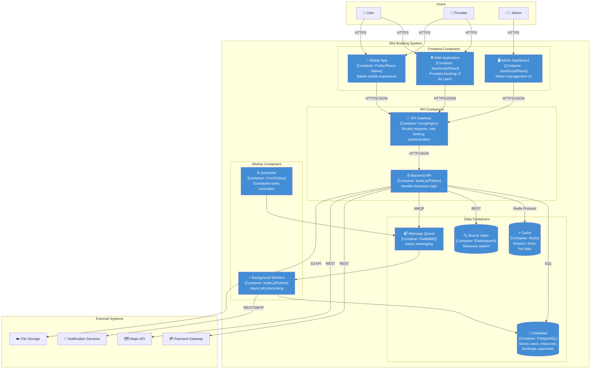
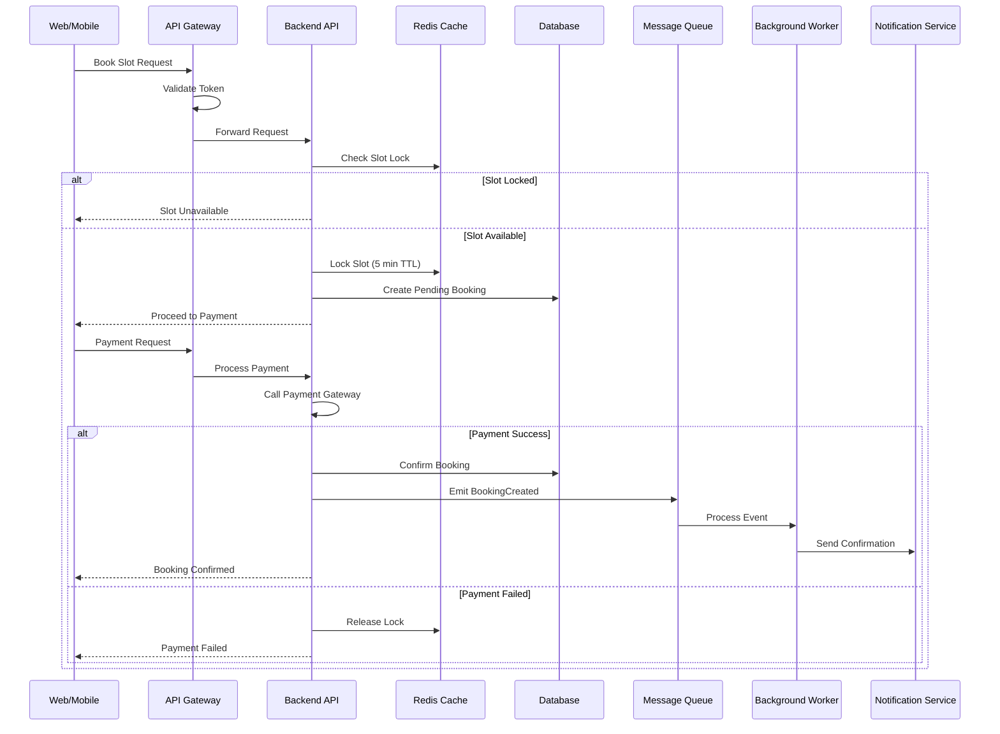
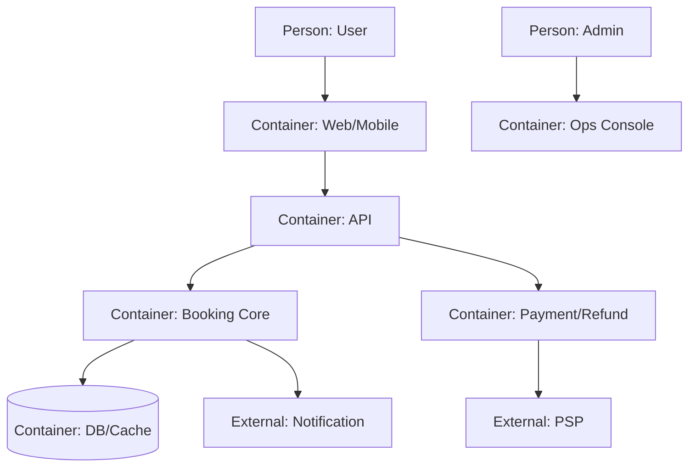

# C4 Context & Container Diagrams - Slot Booking System

> **Platform Independence**: C4 Model provides technology-agnostic visualization at different abstraction levels.

---

## C4 Model Overview

The C4 model provides four levels of abstraction:
1. **Context** - System and its relationships with users and external systems
2. **Container** - High-level building blocks (applications, data stores)
3. **Component** - Inside a container (covered in detailed design)
4. **Code** - Class-level detail (covered in implementation)

---

## Level 1: System Context Diagram



---

## Level 2: Container Diagram



---

## Container Descriptions

| Container | Technology | Responsibility | Scaling |
|-----------|------------|----------------|---------|
| **Web Application** | React/Vue/Angular | User-facing SPA for booking | CDN, Static hosting |
| **Mobile App** | Flutter/React Native | Native mobile experience | App stores |
| **Admin Dashboard** | React + Admin framework | Platform administration | Static hosting |
| **API Gateway** | Kong/Nginx/AWS API GW | Routing, auth, rate limiting | Horizontal |
| **Backend API** | Node.js/Python/Go | Core business logic | Horizontal |
| **Background Workers** | Same as API | Async processing | Horizontal |
| **Scheduler** | Cron/Celery Beat | Timed jobs | Single (HA pair) |
| **Database** | PostgreSQL/MySQL | Persistent data | Read replicas |
| **Cache** | Redis | Sessions, locks, caching | Cluster |
| **Search Index** | Elasticsearch | Full-text search | Cluster |
| **Message Queue** | RabbitMQ/Kafka | Async messaging | Cluster |

---

## Container Interactions



---

## Technology Stack Options

### Option A: Monolithic Start
```
┌─────────────────────────────────────────┐
│              Web Application            │
│              (React/Next.js)            │
└───────────────────┬─────────────────────┘
                    │
┌───────────────────▼─────────────────────┐
│           Monolithic Backend            │
│    (Django/Rails/Express + Queue)       │
└───────────────────┬─────────────────────┘
                    │
        ┌───────────┴───────────┐
        ▼                       ▼
┌───────────────┐       ┌───────────────┐
│  PostgreSQL   │       │    Redis      │
└───────────────┘       └───────────────┘
```

### Option B: Microservices
```
┌─────────────────────────────────────────┐
│            API Gateway (Kong)           │
└───────────────────┬─────────────────────┘
                    │
    ┌───────────────┼───────────────┐
    ▼               ▼               ▼
┌────────┐    ┌──────────┐    ┌─────────┐
│  User  │    │ Resource │    │ Booking │
│Service │    │ Service  │    │ Service │
└────┬───┘    └────┬─────┘    └────┬────┘
     │             │               │
     ▼             ▼               ▼
┌────────┐    ┌──────────┐    ┌─────────┐
│User DB │    │Resource  │    │Booking  │
│        │    │DB        │    │DB       │
└────────┘    └──────────┘    └─────────┘
```

---

## Deployment Contexts

| Deployment | Containers Used | Use Case |
|------------|-----------------|----------|
| **Minimal MVP** | Web, API, DB, Redis | Quick launch, low traffic |
| **Growth Stage** | + Workers, Search, Queue | Higher load, async processing |
| **Enterprise** | Full microservices | Multi-region, high availability |

---

## Key Design Decisions

| Decision | Rationale |
|----------|-----------|
| API Gateway | Single entry point, centralized auth, rate limiting |
| Background Workers | Don't block HTTP requests with slow operations |
| Message Queue | Decouple services, enable retry, eventual consistency |
| Redis Cache | Low-latency slot locking, session management |
| Elasticsearch | Fast resource search with filters, autocomplete |
| PostgreSQL | ACID transactions for booking operations |

---
## Implementation-Ready C4 Context Container

### Slot allocation rules in this document's context
- Allocation decisions must be based on **resource calendar + operational policy + channel limits** before any payment action is attempted.
- All provisional allocations require an explicit **hold record with expiry**, and expiry must be visible to clients.
- Shared-capacity resources must use atomic decrement semantics; exclusive resources must enforce single-active-booking constraints.

### Conflict resolution in this document's context
- Competing writes must use deterministic conflict handling (optimistic version checks or transactional locks as documented here).
- API and admin paths must converge on one canonical conflict reason taxonomy (`SLOT_TAKEN`, `STALE_VERSION`, `PROVIDER_BLOCKED`, `PAYMENT_STATE_MISMATCH`).
- Every conflict rejection must emit structured audit telemetry including actor, correlation ID, and rule version.

### Payment coupling / decoupling behavior
- **Coupled flow**: booking moves to confirmed only after successful authorization/capture.
- **Decoupled flow**: booking can be confirmed with `PAYMENT_PENDING`, but with a bounded grace window and auto-cancel guardrail.
- Compensation is mandatory for split-brain outcomes (payment succeeded but booking failed, or inverse).

### Cancellation and refund policy detail
- Refund outcomes depend on lead time, policy tier, no-show status, and jurisdiction-specific fee constraints.
- Refund processing must be idempotent and expose lifecycle states (`REQUESTED`, `INITIATED`, `SETTLED`, `FAILED`, `MANUAL_REVIEW`).
- Cancellation side effects must include slot reallocation and downstream notification consistency.

### Observability and incident playbook focus
- Monitor: availability latency, hold expiry lag, conflict rate, payment callback success, refund aging.
- Alerts must map to operator runbooks with first-response steps and data reconciliation queries.
- Post-incident review must record policy gaps and required control changes for this documentation area.

### Architecture decisions and trade-offs
- Clarify state ownership boundaries between Slot, Booking, and Payment services.
- Document synchronous vs asynchronous boundaries and backpressure strategies.
- Define reconciliation authority service and data-fix governance path.


### Mermaid C4-style container view

