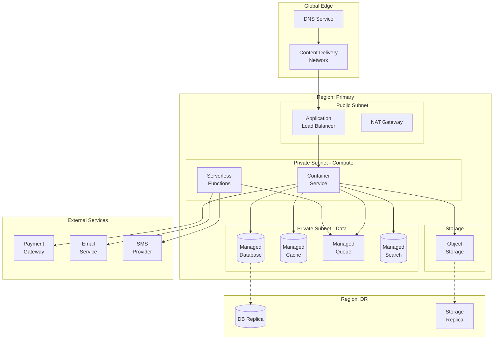
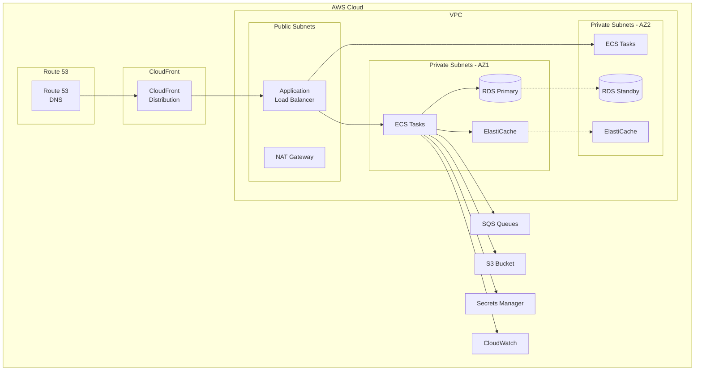
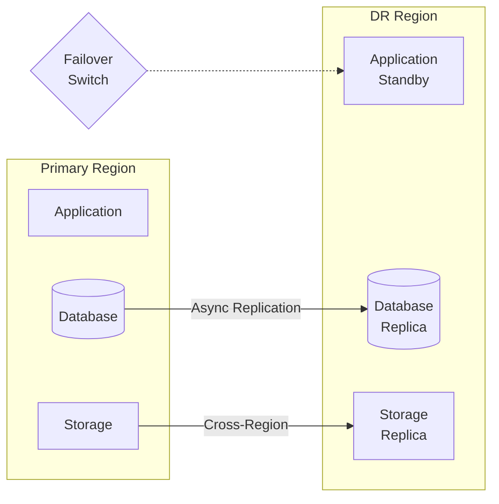
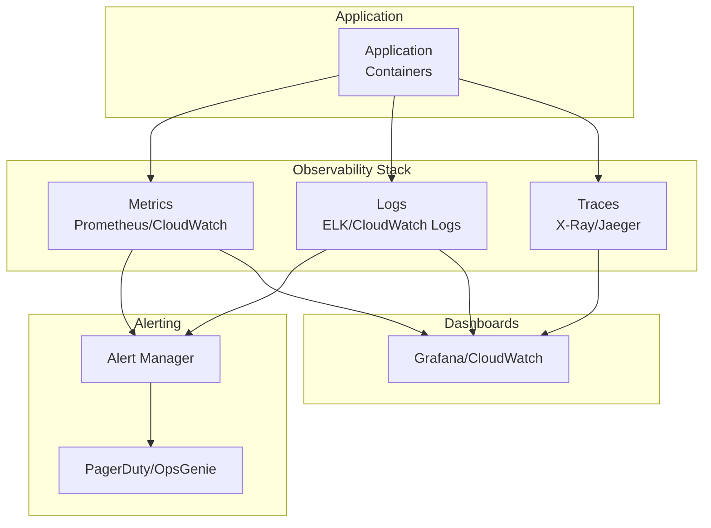
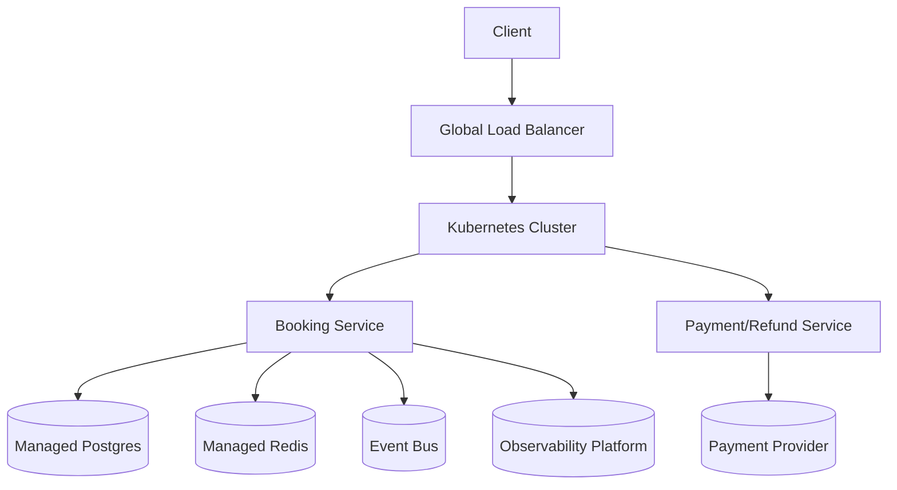

# Cloud Architecture Diagram - Slot Booking System

> **Platform Independence**: Shows cloud-agnostic architecture with provider-specific mappings.

---

## Overview

This document presents cloud architecture patterns that can be implemented on AWS, GCP, Azure, or other providers.

---

## Cloud-Agnostic Architecture

---

## Provider Mapping

| Component | AWS | GCP | Azure |
|-----------|-----|-----|-------|
| DNS | Route 53 | Cloud DNS | Azure DNS |
| CDN | CloudFront | Cloud CDN | Azure CDN |
| Load Balancer | ALB | Cloud Load Balancing | Azure LB |
| Container Service | ECS / EKS | GKE / Cloud Run | AKS / Container Apps |
| Serverless | Lambda | Cloud Functions | Azure Functions |
| Database | RDS PostgreSQL | Cloud SQL | Azure PostgreSQL |
| Cache | ElastiCache | Memorystore | Azure Cache |
| Queue | SQS | Pub/Sub | Service Bus |
| Search | OpenSearch | Elastic Cloud | Cognitive Search |
| Object Storage | S3 | Cloud Storage | Blob Storage |
| Secrets | Secrets Manager | Secret Manager | Key Vault |

---

## AWS-Specific Architecture

---

## Cost Optimization Tiers

### Starter (~$200/month)
- ECS Fargate Spot for workers
- RDS t3.micro (single AZ)
- ElastiCache t3.micro
- S3 Standard

### Growth (~$800/month)
- ECS Fargate (on-demand)
- RDS t3.medium (Multi-AZ)
- ElastiCache r6g.large
- CloudFront with custom domain

### Enterprise (~$3000+/month)
- EKS with auto-scaling
- RDS r6g.xlarge (Multi-AZ)
- ElastiCache cluster mode
- Global Accelerator
- WAF + Shield

---

## Disaster Recovery

| Metric | RTO | RPO |
|--------|-----|-----|
| Standard | 4 hours | 1 hour |
| Critical | 1 hour | 15 minutes |

---

## Monitoring & Observability

---

## Security Best Practices

| Area | Implementation |
|------|----------------|
| Network | VPC, Security Groups, NACLs |
| Identity | IAM roles, MFA, least privilege |
| Encryption | TLS 1.3, KMS for at-rest |
| Secrets | Secrets Manager/Vault |
| Compliance | CloudTrail, Config Rules |
| DDoS | Shield, WAF |

---
## Implementation-Ready Cloud Architecture

### Slot allocation rules in this document's context
- Allocation decisions must be based on **resource calendar + operational policy + channel limits** before any payment action is attempted.
- All provisional allocations require an explicit **hold record with expiry**, and expiry must be visible to clients.
- Shared-capacity resources must use atomic decrement semantics; exclusive resources must enforce single-active-booking constraints.

### Conflict resolution in this document's context
- Competing writes must use deterministic conflict handling (optimistic version checks or transactional locks as documented here).
- API and admin paths must converge on one canonical conflict reason taxonomy (`SLOT_TAKEN`, `STALE_VERSION`, `PROVIDER_BLOCKED`, `PAYMENT_STATE_MISMATCH`).
- Every conflict rejection must emit structured audit telemetry including actor, correlation ID, and rule version.

### Payment coupling / decoupling behavior
- **Coupled flow**: booking moves to confirmed only after successful authorization/capture.
- **Decoupled flow**: booking can be confirmed with `PAYMENT_PENDING`, but with a bounded grace window and auto-cancel guardrail.
- Compensation is mandatory for split-brain outcomes (payment succeeded but booking failed, or inverse).

### Cancellation and refund policy detail
- Refund outcomes depend on lead time, policy tier, no-show status, and jurisdiction-specific fee constraints.
- Refund processing must be idempotent and expose lifecycle states (`REQUESTED`, `INITIATED`, `SETTLED`, `FAILED`, `MANUAL_REVIEW`).
- Cancellation side effects must include slot reallocation and downstream notification consistency.

### Observability and incident playbook focus
- Monitor: availability latency, hold expiry lag, conflict rate, payment callback success, refund aging.
- Alerts must map to operator runbooks with first-response steps and data reconciliation queries.
- Post-incident review must record policy gaps and required control changes for this documentation area.

### Infrastructure operational readiness
- Runtime scaling triggers (CPU, queue depth, payment callback lag).
- Disaster recovery path for booking ledger and refund case stores.
- Secrets, key rotation, and gateway credential failover strategy.

### Mermaid cloud reference architecture

