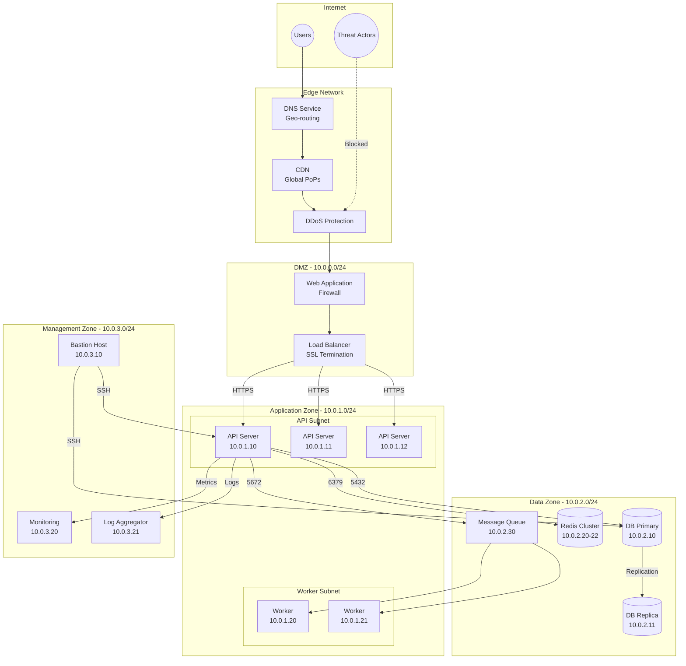
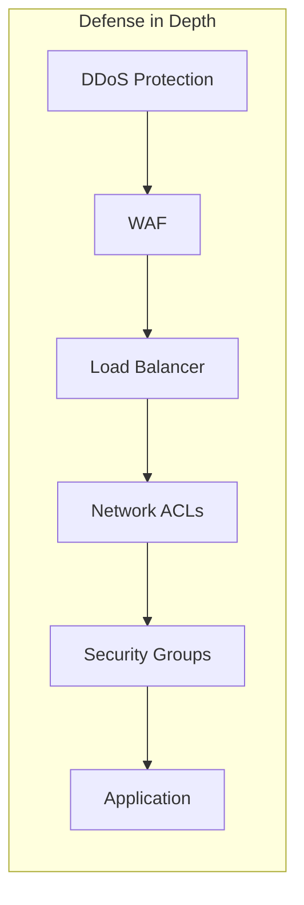
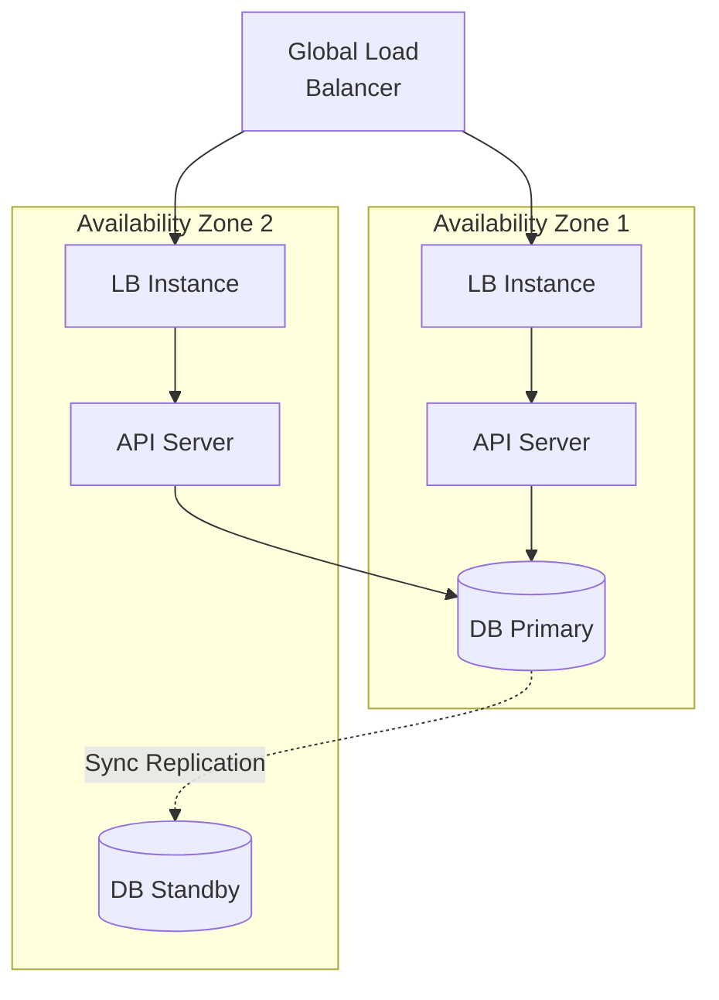
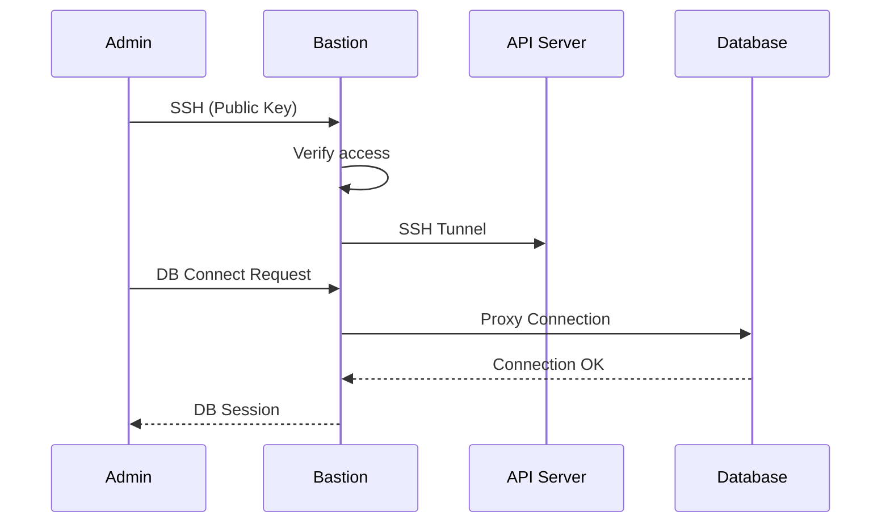
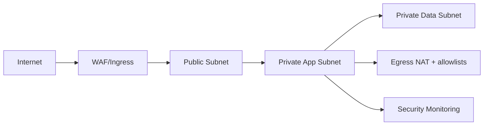

# Network / Infrastructure Diagram - Slot Booking System

> **Platform Independence**: Shows network topology applicable to any hosting environment.

---

## Overview

The Network Infrastructure Diagram shows how network components are organized and connected.

---

## Network Architecture

---

## Security Zones

| Zone | CIDR | Access Level | Purpose |
|------|------|--------------|---------|
| **DMZ** | 10.0.0.0/24 | Public | Edge services |
| **Application** | 10.0.1.0/24 | Private | Application servers |
| **Data** | 10.0.2.0/24 | Restricted | Databases, caches |
| **Management** | 10.0.3.0/24 | Admin only | Ops, monitoring |

---

## Firewall Rules

| From | To | Port | Protocol | Action |
|------|-----|------|----------|--------|
| Internet | LB | 443 | HTTPS | Allow |
| LB | API Servers | 3000 | HTTP | Allow |
| API Servers | DB | 5432 | TCP | Allow |
| API Servers | Redis | 6379 | TCP | Allow |
| API Servers | MQ | 5672 | AMQP | Allow |
| Bastion | All Internal | 22 | SSH | Allow |
| All | All | * | * | Deny |

---

## Network Security Controls

| Layer | Control | Purpose |
|-------|---------|---------|
| Edge | DDoS Protection | Absorb volumetric attacks |
| Edge | WAF | Block OWASP Top 10 |
| Network | Network ACLs | Subnet-level filtering |
| Instance | Security Groups | Instance-level firewall |
| Application | Rate Limiting | Prevent abuse |

---

## High Availability Setup

---

## VPN / Bastion Access

---
## Implementation-Ready Network Infrastructure

### Slot allocation rules in this document's context
- Allocation decisions must be based on **resource calendar + operational policy + channel limits** before any payment action is attempted.
- All provisional allocations require an explicit **hold record with expiry**, and expiry must be visible to clients.
- Shared-capacity resources must use atomic decrement semantics; exclusive resources must enforce single-active-booking constraints.

### Conflict resolution in this document's context
- Competing writes must use deterministic conflict handling (optimistic version checks or transactional locks as documented here).
- API and admin paths must converge on one canonical conflict reason taxonomy (`SLOT_TAKEN`, `STALE_VERSION`, `PROVIDER_BLOCKED`, `PAYMENT_STATE_MISMATCH`).
- Every conflict rejection must emit structured audit telemetry including actor, correlation ID, and rule version.

### Payment coupling / decoupling behavior
- **Coupled flow**: booking moves to confirmed only after successful authorization/capture.
- **Decoupled flow**: booking can be confirmed with `PAYMENT_PENDING`, but with a bounded grace window and auto-cancel guardrail.
- Compensation is mandatory for split-brain outcomes (payment succeeded but booking failed, or inverse).

### Cancellation and refund policy detail
- Refund outcomes depend on lead time, policy tier, no-show status, and jurisdiction-specific fee constraints.
- Refund processing must be idempotent and expose lifecycle states (`REQUESTED`, `INITIATED`, `SETTLED`, `FAILED`, `MANUAL_REVIEW`).
- Cancellation side effects must include slot reallocation and downstream notification consistency.

### Observability and incident playbook focus
- Monitor: availability latency, hold expiry lag, conflict rate, payment callback success, refund aging.
- Alerts must map to operator runbooks with first-response steps and data reconciliation queries.
- Post-incident review must record policy gaps and required control changes for this documentation area.

### Infrastructure operational readiness
- Runtime scaling triggers (CPU, queue depth, payment callback lag).
- Disaster recovery path for booking ledger and refund case stores.
- Secrets, key rotation, and gateway credential failover strategy.

### Mermaid network zoning

