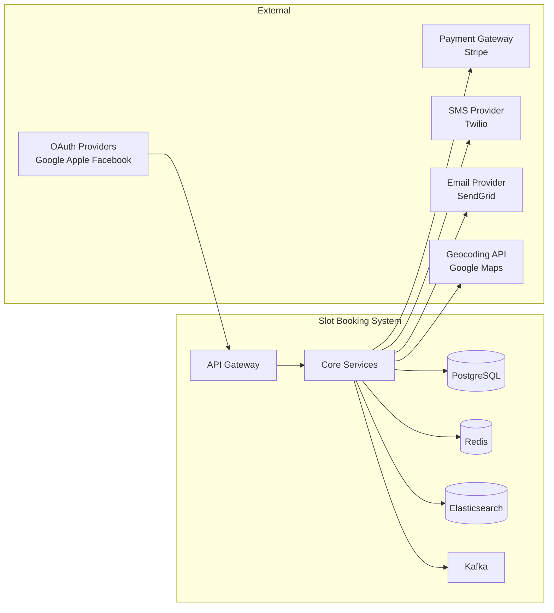

# Requirements Document — Slot Booking System

> **Version:** 2.0.0 | **Status:** Approved | **Last Updated:** 2024-01-01

---

## 1. Project Overview

### 1.1 Purpose

The Slot Booking System provides a production-grade, multi-domain reservation engine enabling customers to discover, reserve, and pay for time-bounded access to any bookable resource — sports courts, meeting rooms, medical appointments, salon chairs, recording studios, parking bays, and event venues — through a unified platform.

### 1.2 Scope

| In Scope | Out of Scope |
|----------|--------------|
| Resource and venue configuration | Hardware access control (smart locks, turnstiles) |
| Slot generation and availability management | Live video streaming of sessions |
| Online booking with payment capture | Physical inventory management |
| Recurring booking series management | Social networking or community features |
| Waitlist management and auto-promotion | In-app video consultation |
| Cancellation, refund, and penalty policies | Travel and accommodation booking |
| Staff scheduling and slot assignment | Third-party marketplace aggregation |
| Corporate quota and bulk booking | Loyalty point programmes |
| SMS, email, and push notifications | |
| Admin override and manual booking | |
| Occupancy reporting and revenue analytics | |

### 1.3 Stakeholders

| Role | Responsibilities |
|------|----------------|
| **Customer** | Discover resources, make bookings, manage reservations, receive notifications |
| **Venue Admin** | Manage resources, schedules, pricing, and staff; view reports |
| **Staff** | View assigned slots, check in customers, mark attendance |
| **Corporate Admin** | Manage corporate account, approve excess bookings, view team usage |
| **Platform Admin** | System configuration, override approvals, compliance, analytics |

---

## 2. Functional Requirements

### 2.1 User Management

| ID | Requirement | Priority | Notes |
|----|-------------|----------|-------|
| FR-UM-001 | System shall allow customers to register with email + password or phone + OTP | Must Have | Password min 10 chars, bcrypt hashing |
| FR-UM-002 | System shall support OAuth 2.0 social login via Google, Apple, and Facebook | Should Have | PKCE flow required |
| FR-UM-003 | System shall maintain customer profiles with contact details, preferences, and booking history | Must Have | |
| FR-UM-004 | System shall enforce role-based access control: Customer, Staff, Venue Admin, Corporate Admin, Platform Admin | Must Have | JWT claims |
| FR-UM-005 | System shall support account recovery via email and SMS | Must Have | Token valid 15 minutes |
| FR-UM-006 | System shall lock accounts after 5 consecutive failed login attempts for 30 minutes | Must Have | |
| FR-UM-007 | System shall support multi-factor authentication for Venue Admin and Platform Admin roles | Should Have | TOTP (RFC 6238) |
| FR-UM-008 | System shall track and expose customer no-show count and prepayment-required flag (BR-09) | Must Have | |

### 2.2 Resource Management

| ID | Requirement | Priority | Notes |
|----|-------------|----------|-------|
| FR-RM-001 | Venue admins shall create and manage `ResourceType` templates defining duration rules, pricing, and overbooking settings | Must Have | |
| FR-RM-002 | Venue admins shall create resources linked to a `ResourceType` with name, capacity, amenities, and images | Must Have | Max 10 images per resource |
| FR-RM-003 | System shall support resource status lifecycle: `ACTIVE` → `MAINTENANCE` → `ACTIVE` / `DECOMMISSIONED` | Must Have | |
| FR-RM-004 | System shall allow venue admins to apply `BlockRule` records to prevent bookings during specific time windows | Must Have | |
| FR-RM-005 | System shall support per-resource pricing overrides for peak hours, weekends, and public holidays | Must Have | Stored in `SlotTemplate` |
| FR-RM-006 | Customers shall search resources by venue, type, capacity, amenities, date, and price range | Must Have | Elasticsearch-backed |
| FR-RM-007 | System shall maintain a public-facing resource page with photos, description, availability calendar, and pricing | Must Have | |

### 2.3 Slot Management

| ID | Requirement | Priority | Notes |
|----|-------------|----------|-------|
| FR-SM-001 | System shall auto-generate slots from `SlotTemplate` and `Schedule` on a configurable rolling horizon (default 90 days) | Must Have | Background job |
| FR-SM-002 | Slot durations must be multiples of `ResourceType.min_duration_minutes` (BR-04) | Must Have | |
| FR-SM-003 | System shall expose a real-time availability grid per resource, queryable by date range | Must Have | Redis-cached; 60-second TTL |
| FR-SM-004 | System shall support buffer time between consecutive slots to allow turnaround/cleaning | Should Have | Configurable per `ResourceType` |
| FR-SM-005 | All slot timestamps must be stored in UTC and converted to venue local time for display | Must Have | IANA timezone |
| FR-SM-006 | Venue admins shall manually create one-off slots outside the template schedule | Should Have | |
| FR-SM-007 | System shall transition slot status automatically: `AVAILABLE` → `BOOKED` → `AVAILABLE` (on cancellation) | Must Have | |

### 2.4 Booking Management

| ID | Requirement | Priority | Notes |
|----|-------------|----------|-------|
| FR-BM-001 | Customers shall book available slots within the advance booking window (BR-01) | Must Have | |
| FR-BM-002 | System shall prevent overlapping bookings on the same resource using distributed locks (BR-02) | Must Have | Redis + DB exclusive lock |
| FR-BM-003 | System shall support booking of multiple slots in a single transaction (e.g., 2-hour session = 2 × 60-min slots) | Should Have | `BookingItem` records |
| FR-BM-004 | Customers shall create recurring booking series with DAILY, WEEKLY, or MONTHLY cadence | Should Have | BR-06 applies |
| FR-BM-005 | System shall validate all occurrences of a recurring series before committing any (BR-06) | Must Have | All-or-nothing creation |
| FR-BM-006 | Customers shall view upcoming and past bookings with full detail and downloadable receipt | Must Have | |
| FR-BM-007 | Customers shall cancel bookings with penalty computed per cancellation policy (BR-03) | Must Have | |
| FR-BM-008 | System shall support rescheduling of a booking to another available slot with refund/charge delta | Should Have | |
| FR-BM-009 | System shall record no-shows 15 minutes after slot end for unattended confirmed bookings (BR-09) | Must Have | Background job |
| FR-BM-010 | Venue admins and platform admins shall create bookings on behalf of customers via admin API | Must Have | Audit trail required |

### 2.5 Waitlist Management

| ID | Requirement | Priority | Notes |
|----|-------------|----------|-------|
| FR-WL-001 | Customers shall join the waitlist for fully-booked slots | Must Have | |
| FR-WL-002 | System shall automatically promote the first eligible waitlist entry on cancellation (BR-05) | Must Have | Event-driven |
| FR-WL-003 | Promoted customers shall have 30 minutes to confirm and pay before the next candidate is evaluated | Must Have | |
| FR-WL-004 | Customers shall view their position and status in the waitlist | Should Have | |
| FR-WL-005 | Customers shall withdraw from the waitlist at any time without penalty | Must Have | |

### 2.6 Payment Management

| ID | Requirement | Priority | Notes |
|----|-------------|----------|-------|
| FR-PM-001 | System shall support online payment at booking time via credit/debit card and UPI/wallets | Must Have | Stripe gateway |
| FR-PM-002 | System shall support pay-at-venue mode where allowed by venue configuration | Should Have | |
| FR-PM-003 | System shall capture payment only after successful booking confirmation (coupled flow) | Must Have | |
| FR-PM-004 | System shall process refunds automatically based on cancellation policy (BR-03) | Must Have | Idempotent |
| FR-PM-005 | System shall support promo codes and corporate rate discounts at checkout | Should Have | |
| FR-PM-006 | System shall generate PDF receipts and send to customer email on payment capture | Must Have | |
| FR-PM-007 | System shall enforce prepayment for customers flagged under BR-09 no-show policy | Must Have | |

### 2.7 Corporate Booking

| ID | Requirement | Priority | Notes |
|----|-------------|----------|-------|
| FR-CB-001 | System shall support corporate accounts with monthly slot quotas (BR-08) | Should Have | |
| FR-CB-002 | Corporate bookings beyond quota shall require corporate admin approval | Should Have | |
| FR-CB-003 | Corporate admins shall view team booking usage and quota utilisation | Should Have | |
| FR-CB-004 | Corporate accounts shall have configurable negotiated penalty rates | Could Have | |

### 2.8 Notifications

| ID | Requirement | Priority | Notes |
|----|-------------|----------|-------|
| FR-NT-001 | System shall send booking confirmation via email and SMS immediately after payment capture | Must Have | |
| FR-NT-002 | System shall send reminder notifications 24 hours and 1 hour before slot start | Must Have | |
| FR-NT-003 | System shall send cancellation and refund notifications within 2 minutes of cancellation | Must Have | |
| FR-NT-004 | System shall send waitlist promotion alerts via push, email, and SMS simultaneously | Must Have | |
| FR-NT-005 | Customers shall configure notification preferences (channel, timing, opt-out) | Should Have | |
| FR-NT-006 | System shall suppress duplicate notifications within a 5-minute dedup window | Must Have | |

### 2.9 Reporting and Analytics

| ID | Requirement | Priority | Notes |
|----|-------------|----------|-------|
| FR-RA-001 | Venue admins shall access occupancy rate reports by resource, date range, and time-of-day | Must Have | |
| FR-RA-002 | System shall provide revenue reports by venue, resource type, and booking channel | Must Have | |
| FR-RA-003 | System shall track and report no-show rates, cancellation rates, and average lead time | Should Have | |
| FR-RA-004 | Platform admins shall access cross-venue analytics and system health dashboards | Should Have | |

---

## 3. Non-Functional Requirements

### 3.1 Performance

| ID | Requirement | Target |
|----|-------------|--------|
| NFR-P-001 | Availability check API response time | p95 < 50 ms (Redis-cached) |
| NFR-P-002 | Booking create API response time | p95 < 200 ms |
| NFR-P-003 | Search API response time | p95 < 300 ms |
| NFR-P-004 | System throughput | ≥ 1,000 bookings/minute |
| NFR-P-005 | Concurrent active users | ≥ 10,000 |

### 3.2 Reliability

| ID | Requirement | Target |
|----|-------------|--------|
| NFR-R-001 | System uptime | 99.9% (≤ 8.7 h downtime/year) |
| NFR-R-002 | Recovery Time Objective (RTO) | ≤ 30 minutes |
| NFR-R-003 | Recovery Point Objective (RPO) | ≤ 5 minutes |
| NFR-R-004 | Data loss prevention | Zero data loss for payment records |

### 3.3 Security

| ID | Requirement | Detail |
|----|-------------|--------|
| NFR-S-001 | All APIs must be authenticated | JWT + API key for integrations |
| NFR-S-002 | PII fields encrypted at rest | AES-256 |
| NFR-S-003 | All traffic encrypted in transit | TLS 1.3 minimum |
| NFR-S-004 | Payment data must be PCI-DSS compliant | No full PAN stored |
| NFR-S-005 | Rate limiting on all public endpoints | 100 req/min per IP; 1000 req/min per authenticated user |
| NFR-S-006 | OWASP Top 10 vulnerabilities addressed | Quarterly security scans |

### 3.4 Scalability

| ID | Requirement | Detail |
|----|-------------|--------|
| NFR-SC-001 | Horizontal scaling of all stateless services | Kubernetes HPA |
| NFR-SC-002 | Database read scaling | Read replicas for reporting queries |
| NFR-SC-003 | Multi-region deployment capability | Active-passive minimum; active-active for cache |

### 3.5 Maintainability

| ID | Requirement | Detail |
|----|-------------|--------|
| NFR-M-001 | Test coverage | ≥ 80% line coverage for core domain logic |
| NFR-M-002 | API backward compatibility | Minimum 6-month deprecation window |
| NFR-M-003 | Deployment pipeline | Zero-downtime rolling deployments |

---

## 4. System Constraints

---

## 5. Acceptance Criteria Summary

| Category | Pass Criteria |
|----------|--------------|
| Booking create | Creates in < 200 ms; rejects overlaps with HTTP 409; enforces advance window |
| Cancellation | Computes correct refund per policy; triggers waitlist promotion within 30 s |
| Waitlist | Promotes next customer within 60 s of cancellation; 30-min confirmation window enforced |
| Payment | Captures on confirm; refunds idempotently; receipts delivered within 2 min |
| No-show | Recorded 15 min after slot end; flag set at 3rd no-show in 90 days |
| Notifications | Confirmation within 30 s; reminders delivered within ±5 min of scheduled time |
| Reporting | Occupancy and revenue reports load in < 5 s for 12-month date range |
